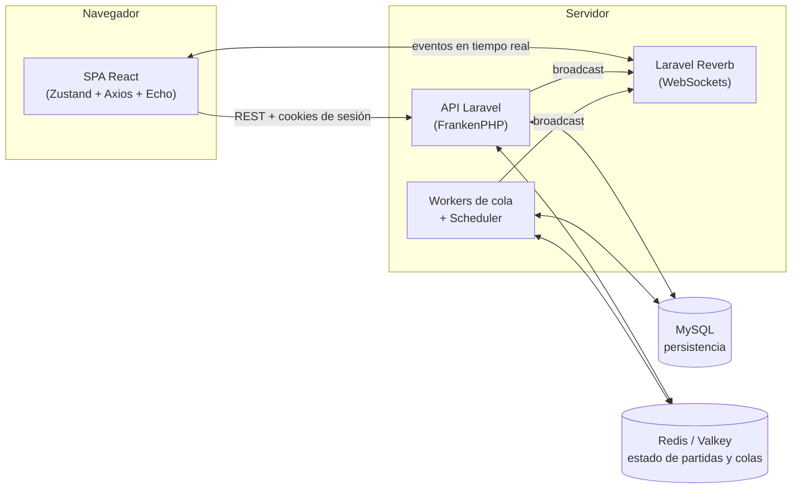

# Chaos Inc.

> Un juego de cartas multijugador en tiempo real para navegador, donde los revólveres son grapadoras, las balas son correos "con copia a todos" y el objetivo es **sobrevivir a la reestructuración**.

**Chaos Inc.** traslada la tensión del juego de mesa [Bang!](https://en.wikipedia.org/wiki/Bang!_(card_game)) del Salvaje Oeste a una oficina moderna al borde del colapso. Es una plataforma web completa: cuentas de usuario, invitados, salas en tiempo real, amistades, logros, niveles de experiencia, clasificación y panel de administración.

El proyecto es el trabajo de fin de curso del ciclo formativo de grado superior de **Desarrollo de Aplicaciones Web**.

- Sitio desplegado: <https://chaosinc.monolook.dev>
- Repositorio: <https://github.com/DavidForero22/Chaos-Inc>

---

## Índice

1. [El juego](#el-juego)
2. [Funcionalidades](#funcionalidades)
3. [Tecnologías](#tecnologías)
4. [Arquitectura](#arquitectura)
5. [Estructura del repositorio](#estructura-del-repositorio)
6. [Puesta en marcha](#puesta-en-marcha)
7. [Variables de entorno](#variables-de-entorno)
8. [Documentación](#documentación)

---

## El juego

La partida se basa en la desconfianza. Excepto el **Jefe**, cuya identidad es pública desde el inicio, el resto de jugadores mantiene su rol oculto.

| Rol | Objetivo de victoria |
| --- | --- |
| **Jefe** | Eliminar a todos los Sindicalistas y a la Becaria. |
| **Secretario** | Proteger al Jefe. Gana si el Jefe gana. |
| **Sindicalista** | Eliminar al Jefe para "liberar" la empresa. |
| **Becaria** | Es el agente del caos: debe ser la última superviviente para ascender a Jefe. |

Una partida admite de **3 a 6 jugadores**. El reparto de roles depende del número de jugadores:

| Jugadores | Jefe | Secretario | Becaria | Sindicalistas |
| :---: | :---: | :---: | :---: | :---: |
| 3 | 1 | 0 | 1 | 1 |
| 4 | 1 | 1 | 1 | 1 |
| 5 | 1 | 1 | 1 | 2 |
| 6 | 1 | 1 | 1 | 3 |

### Mecánicas principales

- **Estrés en lugar de vida.** Cada jugador tiene una barra de estrés. Al alcanzar el máximo (5 el Jefe, 4 el resto) sufre un *burnout* y queda eliminado.
- **Tablero circular y alcance.** Los jugadores se sientan en círculo; solo se puede atacar a quien esté dentro del alcance (1 por defecto). Algunas cartas pasivas lo modifican.
- **Cartas por tipo de efecto:** ataques, curación, defensas (evasión), utilidades (robo, sabotaje, bloqueo…), **pasivas** (equipamiento permanente) y **cartas caóticas** con efectos extremos que requieren sacrificar otra carta.
- **Turnos temporizados.** Cada turno tiene un límite de tiempo configurable por sala (60–120 s). Si se agota, el turno se salta automáticamente.

### Flujo de un turno

1. **Suministros:** el jugador roba dos cartas del mazo central.
2. **Oficina:** juega las cartas que quiera (solo un ataque individual por turno, salvo cartas especiales).
3. **Descarte:** si tiene más cartas que su límite de mano (depende de su estrés actual), debe descartar antes de terminar el turno.

### Estética

Interfaz **"Bureaucratic-Punk"**: texturas de cartón, papel de libreta, sellos de tinta y madera, y modales que simulan expedientes. El tablero de juego es *landscape-first*: en móviles en vertical se solicita girar el dispositivo.

---

## Funcionalidades

- **Autenticación múltiple:** registro con email y contraseña, inicio de sesión con **Google** y **Discord**, y acceso como **invitado** sin registro.
- **Salas en tiempo real:** crear salas públicas o privadas (con contraseña), lista de salas actualizada en vivo, sala de espera, expulsión de jugadores, enlace para compartir.
- **Partidas en tiempo real** con WebSockets, reconexión tolerante a caídas y herencia automática del cargo de Jefe si este se desconecta.
- **Sistema de amistades:** solicitudes, aceptación, rechazo y eliminación de amigos.
- **Progresión:** experiencia, niveles (hasta el 50), **14 logros**, galería de coleccionables y cartas descubiertas.
- **Perfil y estadísticas:** historial de partidas, gráficas de rendimiento, avatar personalizable.
- **Clasificación global** de jugadores.
- **Panel de administración:** gestión de usuarios, partidas y salas, y dashboard de analíticas.
- **Salas de depuración** (solo administradores) con herramientas para manipular la partida y probar el juego.
- **Privacidad:** los invitados se anonimizan y archivan automáticamente pasadas 24 horas, conservando las estadísticas de las partidas.

---

## Tecnologías

| Capa | Tecnologías |
| --- | --- |
| **Frontend** | React 19, TypeScript, Vite, Zustand, React Router, Tailwind CSS 4 + CSS Modules, Axios, Laravel Echo + pusher-js, ECharts |
| **Backend** | PHP 8.2+ (PHP 8.4 en Docker), Laravel 11, Laravel Sanctum (autenticación *stateful* por cookies), Laravel Socialite (Google y Discord), Laravel Reverb (WebSockets), Intervention Image |
| **Datos** | MySQL 8 (usuarios, historial, logros) y Redis/Valkey (estado de salas y partidas en curso, colas) |
| **Infraestructura** | Docker y Docker Compose, FrankenPHP (Caddy), Nginx (frontend en producción), Coolify |
| **Herramientas** | Bun (gestor de paquetes del frontend), Composer, ESLint, Laravel Pint |

---

## Arquitectura

Chaos Inc. sigue un modelo de **desacoplamiento híbrido**: una SPA en React que consume una API REST privada en Laravel y recibe eventos en tiempo real mediante WebSockets.



1. **Acción:** el jugador realiza una acción (por ejemplo, jugar una carta) vía REST.
2. **Procesamiento:** el backend valida la jugada, actualiza el estado en Redis y emite un evento por un canal de presencia.
3. **Difusión:** todos los jugadores conectados reciben el evento y se resincronizan con el servidor, actualizando sus *stores* de Zustand.
4. **Tiempos y resoluciones diferidas:** los temporizadores de turno, las ventanas de reacción y las desconexiones se resuelven con *jobs* programados en cola.

**Decisiones clave:**

- **Redis como fuente de verdad de las partidas en curso.** Las salas y partidas son efímeras (TTL de 24 h); solo al finalizar se persiste el resultado en MySQL.
- **El servidor es autoritativo.** El cliente nunca decide el resultado de una jugada: envía la intención y recibe el estado resultante.
- **Autenticación *stateful* con cookies.** Sanctum en modo SPA con protección CSRF; los invitados son usuarios reales marcados como `is_guest`.
- **Token de partida (`X-Game-Token`)** adicional para identificar al jugador dentro de una sala.

---

## Estructura del repositorio

```text
Chaos-Inc/
├── backend/                  # API Laravel + WebSockets + colas  → backend/README.md
├── frontend/                 # SPA React + TypeScript            → frontend/README.md
├── docker/                   # Dockerfiles, Caddyfile, nginx.conf y entrypoint
├── docs/                     # Documentación técnica detallada
├── docker-compose.yml        # Entorno de desarrollo local
├── docker-compose-prod.yml   # Producción con Docker Compose
├── docker-compose-coolify.yml# Producción en Coolify
├── DEPLOYMENT.md             # Guía de despliegue
└── .env.example              # Variables de entorno de la raíz
```

---

## Puesta en marcha

### Requisitos

- [Docker](https://docs.docker.com/get-docker/) y Docker Compose.
- Git.

### Entorno de desarrollo con Docker

1. **Clonar el repositorio**

   ```bash
   git clone https://github.com/DavidForero22/Chaos-Inc
   cd Chaos-Inc
   ```

2. **Crear los tres archivos `.env`** a partir de sus plantillas

   ```bash
   cp .env.example .env
   cp backend/.env.example backend/.env
   cp frontend/.env.example frontend/.env
   ```

3. **Rellenar los valores obligatorios**
   - `.env` (raíz): `MYSQL_ROOT_PASSWORD`, `MYSQL_PASSWORD` y `REDIS_PASSWORD`.
   - `backend/.env`: `APP_KEY`, las credenciales de Reverb (`REVERB_APP_ID`, `REVERB_APP_KEY`, `REVERB_APP_SECRET`), los datos del superadministrador (`SUPER_ADMIN_*`) y, si se quiere probar el acceso social, las credenciales OAuth de Google y Discord.
   - `frontend/.env`: `VITE_REVERB_APP_KEY` (el mismo valor que `REVERB_APP_KEY`).

   Para generar la `APP_KEY`:

   ```bash
   docker compose run --rm backend php artisan key:generate
   ```

4. **Levantar los servicios**

   ```bash
   docker compose up -d --build
   ```

   Al arrancar, el backend espera a MySQL, ejecuta las migraciones y los *seeders* (cartas, logros y superadministrador) automáticamente.

5. **Abrir la aplicación**

   | Servicio | URL |
   | --- | --- |
   | Frontend | <http://localhost:5173> |
   | API | <http://localhost:8000> (`/api/v1/health` para comprobarla) |
   | WebSockets (Reverb) | `ws://localhost:8080` |
   | MySQL | `localhost:3307` |
   | Redis (Valkey) | `localhost:6379` |

Para destruir contenedores y volúmenes y empezar desde cero:

```bash
docker compose down -v
```

> **Nota:** en desarrollo, Redis ejecuta un `FLUSHALL` cada vez que arranca, por lo que las salas y partidas en curso se pierden al reiniciar el contenedor.

### Servicios del `docker-compose.yml`

| Servicio | Función |
| --- | --- |
| `frontend` | Servidor de desarrollo de Vite con recarga en caliente (Bun). |
| `backend` | API Laravel servida con FrankenPHP. |
| `reverb` | Servidor WebSocket (`php artisan reverb:start`). |
| `worker` | Procesa la cola de *jobs* (3 réplicas). |
| `scheduler` | Ejecuta las tareas programadas (`php artisan schedule:work`). |
| `mysql` | Base de datos relacional. |
| `redis` | Estado de partidas y colas (imagen Valkey 8). |

### Ejecución sin Docker

Requiere PHP 8.2+ con la extensión `phpredis`, Composer, MySQL, Redis y [Bun](https://bun.sh). Consulta [`backend/README.md`](backend/README.md) y [`frontend/README.md`](frontend/README.md) para los pasos detallados de cada parte.

### Despliegue en producción

Consulta [`DEPLOYMENT.md`](DEPLOYMENT.md): incluye la configuración de dominio, HTTPS y variables de entorno con `docker-compose-prod.yml` y `docker-compose-coolify.yml`.

---

## Variables de entorno

Se necesitan **tres archivos `.env`**, uno por capa. Cada carpeta incluye un `.env.example` documentado.

| Archivo | Para qué sirve |
| --- | --- |
| [`.env.example`](.env.example) | Credenciales de MySQL y Redis, y URLs base (`DOMAIN`, `API_URL`, `FRONTEND_URL`) usadas por Docker Compose. |
| [`backend/.env.example`](backend/.env.example) | Configuración de Laravel: base de datos, Redis, sesión/Sanctum, Reverb, OAuth y superadministrador. |
| [`frontend/.env.example`](frontend/.env.example) | Conexión del cliente con Reverb y, opcionalmente, la URL de la API. |

> Los archivos `.env` están excluidos de Git. Nunca subas credenciales reales al repositorio.

---

## Documentación

La documentación técnica detallada vive fuera de este README:

| Documento | Contenido |
| --- | --- |
| [`backend/README.md`](backend/README.md) | Arquitectura, estructura, API, jobs, tareas programadas y configuración del backend. |
| [`frontend/README.md`](frontend/README.md) | Arquitectura, estructura, enrutado, estado, capa de red y *sockets* del frontend. |
| [`docs/rooms.md`](docs/rooms.md) | **Sistema de salas y partidas:** ciclo de vida de una sala, tokens, desconexiones y reconexión, flujo de turnos, reacciones y finalización. |
| [`docs/friendships.md`](docs/friendships.md) | **Sistema de amistades:** modelo de datos, endpoints, reglas y estados de una solicitud. |
| [`docs/social-auth.md`](docs/social-auth.md) | **Autenticación social:** flujo OAuth con Google y Discord, vinculación y desvinculación de cuentas, gestión de errores. |
| [`docs/cards-system.md`](docs/cards-system.md) | **Sistema de cartas:** catálogo, mazo y reparto, instancias, cómo se juega una carta, pasivas, cartas caóticas, estadísticas y galería. |
| [`docs/new-cards.md`](docs/new-cards.md) | **Guía para crear cartas nuevas:** configuración, validación, efecto, base de datos, frontend y pruebas. |
| [`docs/achievements.md`](docs/achievements.md) | **Logros:** catálogo, cuándo se evalúan, notificaciones y guía para crear logros nuevos. |
| [`docs/levels.md`](docs/levels.md) | **Niveles y experiencia:** cómo se gana XP, la curva de niveles y cómo modificar el sistema. |
| [`DEPLOYMENT.md`](DEPLOYMENT.md) | Guía de despliegue en producción. |
