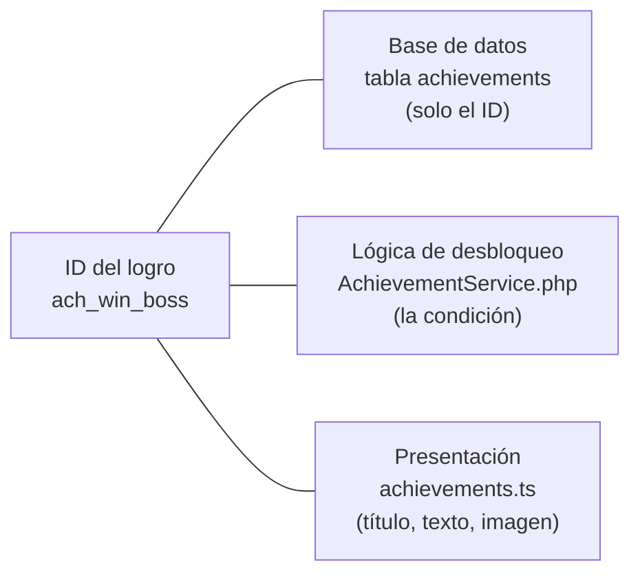
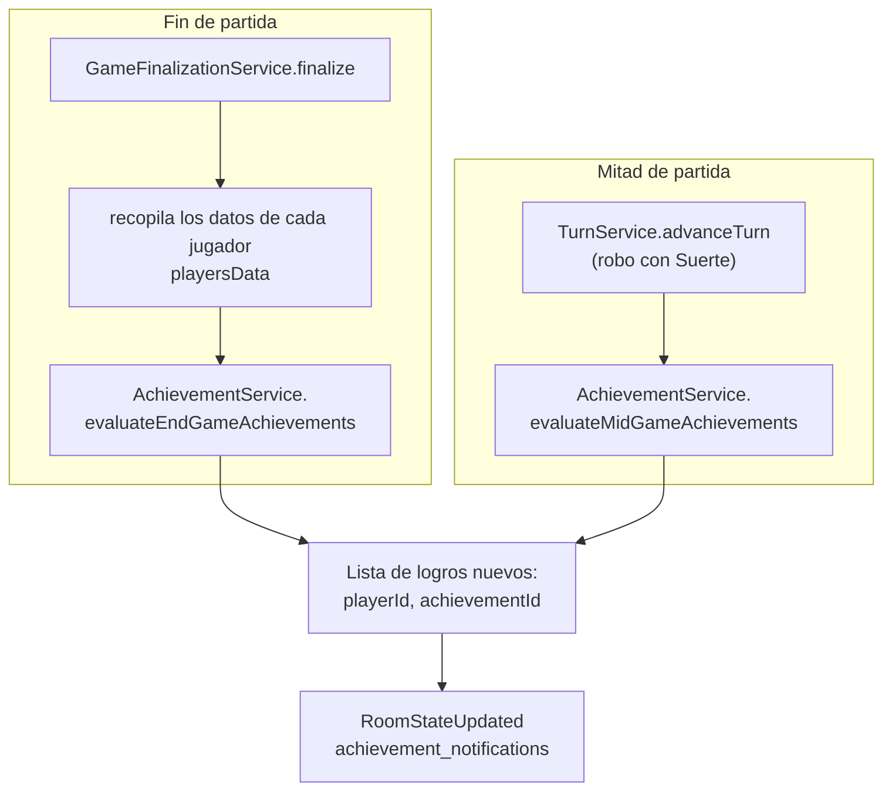
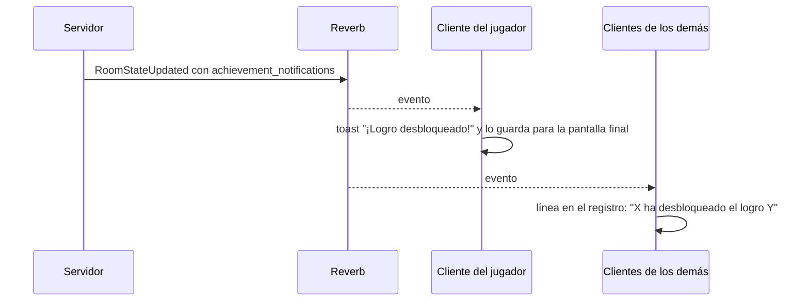

# Logros: cómo funcionan y cómo crear uno nuevo

Este documento explica el sistema de logros de Chaos Inc. —dónde se define cada logro, cuándo se evalúa y cómo se notifica al jugador— y, sobre esa base, incluye una guía paso a paso para **crear logros nuevos**.

**Código fuente de referencia**

| Pieza | Archivo |
| --- | --- |
| Lógica de desbloqueo | [`AchievementService`](../backend/app/Services/Game/Engine/AchievementService.php) |
| Registro de logros en la base de datos | [`AchievementSeeder`](../backend/database/seeders/AchievementSeeder.php), [`Achievement`](../backend/app/Models/Achievement.php) |
| Punto de llamada (fin de partida) | [`GameFinalizationService::finalize`](../backend/app/Services/Game/Status/GameFinalizationService.php) |
| Punto de llamada (mitad de partida) | [`TurnService::advanceTurn`](../backend/app/Services/Game/Engine/TurnService.php) |
| Datos de presentación | [`frontend/src/data/app/achievements.ts`](../frontend/src/data/app/achievements.ts) |
| Imágenes | [`frontend/public/achievements/`](../frontend/public/achievements/) |

---

## Índice

1. [Visión general](#1-visión-general)
2. [Catálogo actual](#2-catálogo-actual)
3. [Cuándo y cómo se evalúan](#3-cuándo-y-cómo-se-evalúan)
4. [Persistencia](#4-persistencia)
5. [Notificación al jugador](#5-notificación-al-jugador)
6. [Dónde se ven los logros](#6-dónde-se-ven-los-logros)
7. [Guía: crear un logro nuevo](#7-guía-crear-un-logro-nuevo)
8. [Recetas según el tipo de logro](#8-recetas-según-el-tipo-de-logro)
9. [Lista de comprobación final](#9-lista-de-comprobación-final)
10. [Errores frecuentes](#10-errores-frecuentes)
11. [Puntos a revisar](#11-puntos-a-revisar)

---

## 1. Visión general

Un logro se compone de **tres piezas que viven en sitios distintos** y que se unen por un **identificador de texto** (`ach_…`):



| Pieza | Qué contiene | Dónde |
| --- | --- | --- |
| **Registro** | Solo el ID. Es necesario por la clave foránea de la tabla de logros desbloqueados. | `achievements` (MySQL), poblada por `AchievementSeeder`. |
| **Condición** | Cuándo se concede. | `AchievementService` (PHP). |
| **Presentación** | Título, descripción, *lore*, imagen y si está activo. | `achievements.ts` (frontend). |

El backend **no conoce los textos ni las imágenes**; el frontend **no conoce las condiciones**. Si falta una de las tres piezas, el logro no funciona correctamente.

**Reglas generales del sistema**

- Solo los **usuarios registrados** pueden desbloquear logros. Los invitados se ignoran.
- Un logro se desbloquea **una sola vez** por usuario; si ya lo tenía, no se vuelve a notificar.
- Los logros de **fin de partida** solo se evalúan para quien **ha ganado** (el bloque está dentro de `if ($player['has_won'])`), salvo que el nuevo logro se coloque fuera de ese bloque.
- Los logros **no son retroactivos**: se conceden al jugar a partir de que existan.
- Las partidas **canceladas** no evalúan logros.

---

## 2. Catálogo actual

14 logros registrados, **10 activos** y 4 sin implementar.

| ID | Título | Condición | Cuándo se evalúa |
| --- | --- | --- | --- |
| `ach_win_intern` | El Lobo de Chaos INC | Ganar como Becaria (sin haber sido ascendida a Jefe). | Fin de partida |
| `ach_win_secretary` | Lamebotas Profesional | Ganar como Secretario (sin haber sido ascendido). | Fin de partida |
| `ach_win_boss` | Jefazo del Año | Ganar como Jefe original. | Fin de partida |
| `ach_win_unionist` | Abajo con el Trabajo | Ganar como Sindicalista. | Fin de partida |
| `ach_last_unionist` | Solo ante el Peligro | Ganar siendo el único Sindicalista vivo en una partida de 6 jugadores. | Fin de partida |
| `ach_inherited_boss` | Heredero del Poder | Ganar tras haber sido ascendido a jefe interino. | Fin de partida |
| `ach_no_passives` | Sin Bolsillos | Ganar sin haber equipado ninguna pasiva. | Fin de partida |
| `ach_no_defense` | Pecho de Hierro | Ganar sin haber esquivado ni bloqueado con escudo ningún ataque. | Fin de partida |
| `ach_one_hp` | Invencible | Ganar con 1 punto de vida restante. | Fin de partida |
| `ach_luck` | Suerte del Principiante | Robar carta extra con *Suerte* 3 turnos seguidos. | **Mitad de partida** |
| `ach_triple_kill` | Cazador Fiscal | Eliminar a 3 jugadores en una partida. | *Sin implementar* |
| `ach_failed_mass_attack` | Desgraciado Mal-pagado | Ataque masivo en partida de 6 que todos esquiven o bloqueen. | *Sin implementar* |
| `ach_play_10` | Empleado en Prácticas | Jugar 10 partidas. | *Sin implementar* |
| `ach_play_25` | Empleado Indefinido | Jugar 25 partidas. | *Sin implementar* |

Los cuatro últimos están registrados en el *seeder* y descritos en el frontend con `active: false`, pero **ninguna condición los concede todavía**. Son un buen punto de partida para practicar la guía ([ver recetas](#8-recetas-según-el-tipo-de-logro)).

---

## 3. Cuándo y cómo se evalúan

Hay **dos puntos de evaluación**:



### 3.1 Fin de partida: `evaluateEndGameAchievements`

Recibe la lista `$playersData` (una entrada por jugador que no abandonó) y el número total de jugadores. Por cada jugador registrado construye una lista `$achievementsToUnlock` y, al final, la compara con lo que el usuario ya tiene.

**Datos disponibles en cada elemento de `$playersData`:**

| Campo | Significado |
| --- | --- |
| `player_id`, `user_id` | Identificador del jugador en la sala y del usuario. |
| `is_guest` | Si es invitado (se ignora). |
| `display_name` | Nombre. |
| `has_won` | Si su bando ganó (el jefe interino cuenta como Jefe). |
| `role` | Rol original: `boss`, `secretary`, `intern`, `union`. |
| `acting_boss` | Si terminó como jefe interino. |
| `is_dead` | Si fue eliminado. |
| `remaining_hp` | Vida que le quedaba (`estrés máximo − estrés actual`). |
| `damage_dealt`, `damage_received`, `healing_done` | Daño causado, recibido y curación. |
| `cards_played`, `passives_played` | Cartas jugadas y pasivas equipadas. |
| `eliminations` | Jugadores que eliminó. |
| `dodged_attacks` | Ataques esquivados con la carta Evasión. |
| `dodged_or_defended` | `1` si esquivó o se defendió con Escudo al menos una vez; `0` si nunca. |
| `cards_stolen` | Cartas robadas. |
| `card_details` | Veces que jugó cada carta (`card_{id}` → número). |

Además se calcula una vez, antes del bucle, el número de Sindicalistas que siguen vivos (`$aliveUnionistsCount`).

### 3.2 Mitad de partida: `evaluateMidGameAchievements`

Para logros que se consiguen **durante** la partida, no al final. Recibe el ID del usuario y un **array de contexto** con lo que haga falta. Hoy solo lo usa la racha de *Suerte*:

```php
$newAchievements = app(AchievementService::class)
    ->evaluateMidGameAchievements((int) $userId, ['luck_streak' => $luckStreak]);
```

Dentro, cada logro es un bloque que mira el contexto, comprueba que el usuario **no lo tenga ya** y lo concede con `attach`. Devuelve los IDs de los logros nuevos.

Quien llama es responsable de **notificar** (emitir el evento con los logros). En el caso de *Suerte*, `TurnService` los incluye en el `RoomStateUpdated` que ya emite al robar una carta extra.

---

## 4. Persistencia

| Tabla | Contenido |
| --- | --- |
| `achievements` | Catálogo: `id` (cadena, clave primaria) y marcas de tiempo. |
| `achievement_user` | Logros desbloqueados: `user_id`, `achievement_id`, `unlocked_at`. **Única** por `(user_id, achievement_id)`. |

`achievement_user.achievement_id` es una **clave foránea** hacia `achievements.id`. Por eso **el ID debe existir en `achievements` antes de poder concederse**: si no, la inserción falla.

El desbloqueo de fin de partida hace:

1. Consulta qué logros de la lista ya tiene el usuario.
2. Se queda con los **nuevos** (`array_diff`).
3. Los guarda con `syncWithoutDetaching` (no borra los que ya tenía) con `unlocked_at = now()`.
4. Añade cada nuevo logro a la lista de respuesta `{ playerId, achievementId }`.

---

## 5. Notificación al jugador



El evento `RoomStateUpdated` lleva un campo `achievement_notifications`:

```json
"achievement_notifications": [ { "playerId": "12", "achievementId": "ach_win_boss" } ]
```

En el frontend, [`useGameSockets`](../frontend/src/hooks/game/network/useGameSockets.ts) procesa cada elemento:

- Si es **del propio jugador**: muestra un aviso emergente (`AchievementNotification`, ~5 s) con la imagen, el título y la descripción, y lo guarda en `matchAchievements` para listarlo en la **pantalla de fin de partida**.
- Si es **de otro jugador**: añade una notificación y una línea al registro de la partida («*Ana ha desbloqueado el logro "…"*»).

Para ambos casos, el título y la imagen se buscan en `ACHIEVEMENTS` por el ID. Si el ID no existe allí, se muestra el propio ID y la imagen de relleno.

---

## 6. Dónde se ven los logros

| Lugar | Comportamiento |
| --- | --- |
| **Perfil** (`ProfileAchievements`) | Cuadrícula de pegatinas. Desbloqueados: imagen, fecha y descripción. Bloqueados: silueta y descripción. Los `active: false` aparecen como «Próximamente…». El **porcentaje** de completado y el color del marco (bronce → platino) se calculan solo sobre los logros **activos**. |
| **Aviso en partida** | Toast al desbloquear (ver arriba). |
| **Pantalla de fin de partida** | Lista de los logros obtenidos en esa partida. |
| **Galería (extras)** | Los *extras* se desbloquean al **acumular un número de logros** (`achievements_required` en `config/gallery.php`: 1, 2, 3, 4, 6, 8 y 10). Se cuentan todas las filas de `achievement_user`. |
| **Administración** | El modal de edición de usuario permite activar o quitar logros a mano (los activos del frontend). `PUT /users/{user}` con `activeAchievements` **sincroniza** la lista con fecha actual para los nuevos. |

> Al añadir logros nuevos **activos**, el 100 % del perfil exige conseguirlos también, y los *extras* de la galería siguen necesitando 10 logros en total.

---

## 7. Guía: crear un logro nuevo

Ejemplo guía: desbloquear *Cazador Fiscal* (`ach_triple_kill`, «Elimina a 3 jugadores en una misma partida»). Los pasos son los mismos para cualquier logro.

### Paso 1: elegir el ID y registrarlo en la base de datos

El ID es una cadena en minúsculas con prefijo `ach_` (por ejemplo `ach_triple_kill`). **Una vez publicado, no se cambia** (queda guardado en `achievement_user`).

Añádelo a [`AchievementSeeder`](../backend/database/seeders/AchievementSeeder.php):

```php
$achievements = [
    // …
    ['id' => 'ach_one_hp'],
    ['id' => 'ach_mi_nuevo_logro'],   // ← nuevo
];
```

Y ejecútalo (usa `insertOrIgnore`, por lo que es seguro repetirlo):

```bash
# En local
php artisan db:seed --class=AchievementSeeder

# Con Docker
docker compose exec backend php artisan db:seed --class=AchievementSeeder
```

> En despliegues con Docker, el *entrypoint* ejecuta `migrate --force --seed` en cada arranque, así que un redespliegue ya registra los IDs nuevos.

### Paso 2: escribir la condición en `AchievementService`

Elige el punto de evaluación:

- **Fin de partida** → `evaluateEndGameAchievements` (la mayoría de logros).
- **Mitad de partida** → `evaluateMidGameAchievements` (logros que deben saltar en el momento).

Para *Cazador Fiscal* (fin de partida), tras el bloque `if ($player['has_won']) { … }` y **antes** del código que guarda los desbloqueos, para que cuente aunque el jugador pierda:

```php
// Cazador Fiscal: 3 eliminaciones en la misma partida (gane o pierda)
if ((int) ($player['eliminations'] ?? 0) >= 3) {
    $achievementsToUnlock[] = 'ach_triple_kill';
}
```

El resto (comprobar si ya lo tenía, guardarlo y devolverlo para notificar) ya lo hace el método. **No hace falta tocar nada más del backend** para logros de fin de partida basados en datos que ya existen en `$playersData`.

> Si el logro debe contar **solo si se gana**, colócalo **dentro** del bloque `if ($player['has_won'])`.

### Paso 3: describirlo en el frontend

En [`data/app/achievements.ts`](../frontend/src/data/app/achievements.ts), añade o edita la entrada con el mismo ID:

```ts
{
    id: "ach_triple_kill",
    title: "Cazador Fiscal",
    technicalDescription: "Elimina a 3 jugadores en una misma partida.",
    lore: "Los abogados y empleados de Hacienda te miran con temor.",
    image: "/achievements/ach_11.jpg",
    active: true,
},
```

| Campo | Descripción |
| --- | --- |
| `id` | Idéntico al del backend. |
| `title` | Nombre visible. |
| `technicalDescription` | Qué hay que hacer, redactado como instrucción clara (se muestra en bloqueado y desbloqueado). |
| `lore` | Texto de ambientación humorístico. |
| `image` | Ruta pública de la imagen. |
| `active` | `true` cuando la condición ya funciona. Con `false` se muestra como «Próximamente…» y no cuenta para el porcentaje del perfil ni aparece en el modal de administración. |

El **orden** del array es el orden de las pegatinas en el perfil.

### Paso 4: añadir la imagen

Coloca la imagen en [`frontend/public/achievements/`](../frontend/public/achievements/). La que se usa es la indicada en `image` (los logros actuales siguen el patrón `ach_N.jpg`). Mientras no exista, se puede usar `ach_placeholder.jpg`. Los archivos `*_big.png` y `*_sketch.*` que hay en la carpeta no los referencia hoy ningún código.

### Paso 5: probar

Hay varias formas de probarlo sin jugar docenas de partidas:

1. **Sala de depuración** (`is_debug`, solo administradores): con las herramientas del tablero puedes modificar estrés, matar jugadores y **forzar una victoria** (`room_actions.force_win`), lo que ejecuta la finalización completa (incluidos los logros) con el estado actual.
2. **Panel de administración:** puedes asignar o quitar el logro a un usuario para ver cómo se muestra en el perfil sin conseguirlo.
3. **Revisa la tabla** `achievement_user` tras la partida.

Recuerda que se necesita un **usuario registrado** (no invitado), que la partida **termine con ganador** (las canceladas no evalúan logros) y, para logros de ganador, que ese usuario esté en el bando ganador.

---

## 8. Recetas según el tipo de logro

### 8.1 Basado en datos que ya existen

Si el dato está en la tabla de [3.1](#31-fin-de-partida-evaluateendgameachievements), basta una condición (como *Cazador Fiscal* arriba). Otros ejemplos:

```php
// Sanador: curar 5 o más puntos de estrés en una partida
if ((int) ($player['healing_done'] ?? 0) >= 5) {
    $achievementsToUnlock[] = 'ach_healer';
}

// Ladrón: robar 4 cartas o más
if ((int) ($player['cards_stolen'] ?? 0) >= 4) {
    $achievementsToUnlock[] = 'ach_thief';
}
```

### 8.2 Que necesita un dato nuevo

Si la condición usa algo que el sistema aún no mide (por ejemplo, *Desgraciado Mal-pagado*: «ataque masivo en partida de 6 que todos esquiven o bloqueen»):

1. **Inicializa** la estadística en el hash `stats` del jugador al crear la partida ([`LiveGameService::assignRolesAndCards`](../backend/app/Services/Game/LiveGameService.php)): `'failed_mass_attack' => 0`.
2. **Increméntala** donde ocurre el hecho (en este caso, al resolver el ataque masivo en `GameReactionService` / `ResolveMultiAttackJob`, cuando no hubo ningún daño).
3. **Inclúyela en `$playersData`** en [`GameFinalizationService::finalize`](../backend/app/Services/Game/Status/GameFinalizationService.php), junto al resto de campos: `'failed_mass_attack' => (int) ($pStats['failed_mass_attack'] ?? 0)`.
4. **Evalúala** en `evaluateEndGameAchievements` como en la receta anterior.

### 8.3 Basado en el historial del usuario

Para logros acumulativos («Juega 10 partidas»), la condición consulta MySQL en lugar de la partida actual:

```php
// Requiere: use App\Models\GameUser;
// Empleado en Prácticas: 10 partidas jugadas
$gamesPlayed = GameUser::where('user_id', $user->id)->count() + 1; // +1: la partida actual aún no está guardada
if ($gamesPlayed >= 10) {
    $achievementsToUnlock[] = 'ach_play_10';
}
```

> **Importante:** `evaluateEndGameAchievements` se ejecuta **antes** de `GameService::createGame` en `finalize`, así que la partida en curso **todavía no está en la base de datos**; de ahí el `+ 1`. Decide también si las partidas **canceladas** cuentan (`game_user` las incluye) y si el logro debe exigir haber ganado.

### 8.4 Que salta durante la partida

Siguiendo el ejemplo de *Suerte*:

1. En `evaluateMidGameAchievements`, añade un bloque que lea el contexto que necesites, compruebe que el usuario no lo tiene ya y lo conceda con `attach`, devolviendo el ID:

   ```php
   if (($context['luck_streak'] ?? 0) >= 3) {
       $achievementId = 'ach_luck';
       $alreadyHas = $user->achievements()->where('achievements.id', $achievementId)->exists();

       if (!$alreadyHas) {
           $user->achievements()->attach($achievementId, ['unlocked_at' => now()]);
           $unlocked[] = $achievementId;
       }
   }
   ```

2. **Llámalo desde el punto del juego donde ocurre el hecho**, solo para usuarios registrados (`is_guest` falso), pasando el contexto.
3. **Emite la notificación tú mismo**: crea el evento `RoomStateUpdated` incluyendo en `achievementsUnlocked` el array `[ ['playerId' => $pid, 'achievementId' => $id] ]` (es el cuarto parámetro del constructor). Si no lo emites, el logro se guarda en silencio y el jugador no recibe aviso.

---

## 9. Lista de comprobación final

- [ ] ID `ach_…` único y en minúsculas.
- [ ] Añadido a `AchievementSeeder` y *seeder* ejecutado.
- [ ] Condición escrita en `evaluateEndGameAchievements` o `evaluateMidGameAchievements`.
- [ ] Si necesita datos nuevos: estadística inicializada, incrementada e incluida en `$playersData`.
- [ ] Si es a mitad de partida: se emite `RoomStateUpdated` con `achievementsUnlocked`.
- [ ] Entrada en `achievements.ts` con el **mismo ID**, textos e imagen, y `active: true`.
- [ ] Imagen en `public/achievements/`.
- [ ] Probado con un usuario **registrado**, en una partida terminada (no cancelada).
- [ ] Documentado en el apartado «Catálogo actual» si se mantiene esta guía.

---

## 10. Errores frecuentes

| Síntoma | Causa probable |
| --- | --- |
| Error de clave foránea al terminar la partida. | El ID no está en la tabla `achievements`: falta ejecutar el *seeder*. |
| El logro nunca se concede. | El usuario es invitado, la partida se canceló, el jugador no ganó (si el bloque está dentro de `has_won`) o la condición usa un dato que no está en `$playersData`. |
| Se concede pero **no hay aviso** ni título en el perfil. | Falta la entrada en `achievements.ts` o el ID difiere (se muestra el ID y la imagen de relleno). |
| Aparece como «Próximamente…». | La entrada tiene `active: false`. |
| Se concede dos veces el mismo logro. | No debería: `achievement_user` es único. Si ocurre, revisa que no se use `attach` sin comprobar antes que no lo tiene. |
| Un logro acumulativo se concede una partida tarde. | Se olvidó el `+ 1` por no estar aún guardada la partida actual. |
| El logro de mitad de partida no avisa. | No se incluyó en el `RoomStateUpdated` (cuarto parámetro). |
| Los cambios del servidor no se ven. | Reiniciar `backend`, `worker` y `reverb` (procesos de larga duración); en el frontend, recompilar. |

---

## 11. Puntos a revisar

| # | Dónde | Observación |
| :-: | --- | --- |
| 1 | `AchievementSeeder` / `achievements.ts` | Hay 4 logros (`ach_triple_kill`, `ach_failed_mass_attack`, `ach_play_10`, `ach_play_25`) registrados pero sin condición ni imagen definitiva. Siguen `active: false`. |
| 2 | `GameFinalizationService::finalize` | Los logros se evalúan **antes** de guardar la partida (`createGame`). Cualquier logro basado en el historial debe tenerlo en cuenta (ver [8.3](#83-basado-en-el-historial-del-usuario)). |
| 3 | `evaluateEndGameAchievements` | La numeración de los comentarios salta del 7 al 9 (falta el «8», que corresponde a un logro retirado o sin implementar). |
| 4 | `public/achievements/` | Los archivos `*_big.png` y `*_sketch.*` no se referencian desde el código actual. |
