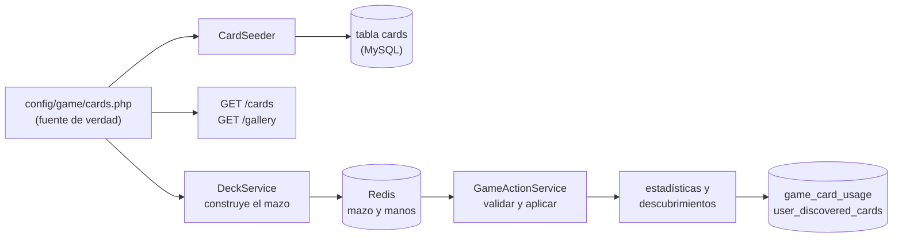
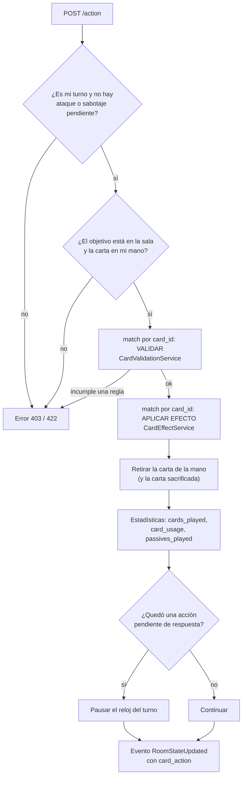

# Sistema de cartas

Este documento explica cómo funcionan las cartas de Chaos Inc.: dónde se definen, cómo se construye y reparte el mazo, qué ocurre cuando se juega una carta, cómo se registran el uso y los descubrimientos, y cómo las muestra el frontend.

> Para **añadir una carta nueva**, consulta la guía paso a paso en [`new-cards.md`](new-cards.md). Este documento es la referencia de cómo funciona lo que ya existe.

**Código fuente de referencia**

| Pieza | Archivo |
| --- | --- |
| Catálogo de cartas | [`config/game/cards.php`](../backend/config/game/cards.php) |
| Pasivas permitidas | [`config/game/perks.php`](../backend/config/game/perks.php) |
| Cartas caóticas (probabilidad) | [`config/game/chaotic.php`](../backend/config/game/chaotic.php) |
| Mazo y reparto | [`DeckService`](../backend/app/Services/Game/Engine/DeckService.php) |
| Jugar una carta | [`GameActionService`](../backend/app/Services/Game/Actions/GameActionService.php) |
| Reglas de uso (validación) | [`CardValidationService`](../backend/app/Services/Game/Engine/CardValidationService.php) |
| Efectos | [`CardEffectService`](../backend/app/Services/Game/Actions/CardEffectService.php) |
| Mano, descartes y límite | [`PlayerHandService`](../backend/app/Services/Game/Engine/PlayerHandService.php) |
| Reacciones (evasión, sabotaje…) | [`GameReactionService`](../backend/app/Services/Game/Actions/GameReactionService.php) |
| Galería de cartas | [`GalleryService`](../backend/app/Services/GalleryService.php), [`CardHelper`](../backend/app/Support/CardHelper.php) |

---

## Índice

1. [Visión general](#1-visión-general)
2. [Anatomía de una carta](#2-anatomía-de-una-carta)
3. [Catálogo actual](#3-catálogo-actual)
4. [El mazo](#4-el-mazo)
5. [Instancias de carta y la mano](#5-instancias-de-carta-y-la-mano)
6. [Jugar una carta](#6-jugar-una-carta)
7. [Reglas y efectos de cada carta](#7-reglas-y-efectos-de-cada-carta)
8. [Pasivas (equipamiento)](#8-pasivas-equipamiento)
9. [Cartas caóticas](#9-cartas-caóticas)
10. [Uso, estadísticas y descubrimientos](#10-uso-estadísticas-y-descubrimientos)
11. [Las cartas en el frontend](#11-las-cartas-en-el-frontend)
12. [Puntos a revisar](#12-puntos-a-revisar)

---

## 1. Visión general



- **El catálogo vive en un archivo de configuración PHP**, no en la base de datos. Es la única fuente de verdad de lo que *es* una carta (nombre, texto, copias en el mazo, imagen…).
- La tabla **`cards`** de MySQL es solo un **espejo mínimo** (`id`, `base_name`, `type`, `category`) que se rellena con `CardSeeder`. Existe para poder tener claves foráneas desde `game_card_usage` y `user_discovered_cards` y para las analíticas.
- **El comportamiento no está en la configuración**, sino en código: cada carta se identifica por su `id` numérico y dos bloques `match` de `GameActionService` la enlazan con su regla de validación y su efecto.
- Durante la partida, el mazo y las manos viven en **Redis** (ver [`rooms.md`](rooms.md)).

---

## 2. Anatomía de una carta

Cada entrada de `config/game/cards.php` (dentro de la clave `cards`) tiene este formato:

```php
[
    'id'           => 1,
    'type'         => 'attack',
    'target'       => 'opponent',
    'base_name'    => 'Ataque',
    'display_name' => 'Ataque',
    'description'  => 'Inflige 1 punto de estrés a un oponente vivo dentro de tu rango de visión.',
    'lore'         => 'Al contable le cayó una grapadora en la cabeza.',
    'icons'        => ['opponent', 'attack'],
    'count'        => 28,
    'image'        => 'attack.png',
    'category'     => 'normal',
],
```

| Campo | Tipo | Para qué sirve |
| --- | --- | --- |
| `id` | entero único | Identidad de la carta. Se usa en el código (`match`), en la base de datos (claves foráneas) y en el frontend. **No se debe cambiar ni reutilizar.** |
| `type` | `attack` \| `heal` \| `default` \| `perk` | Clasificación mecánica. Define el color del borde en el frontend y el tipo de notificación. Es un `enum` en MySQL. |
| `target` | `self` \| `opponent` \| `opponents` \| `all` \| `none` | A quién afecta. El **frontend** lo usa para decidir si la carta se juega con un botón («usar») o eligiendo a un rival. El servidor **no** lo consulta. |
| `base_name` | texto | Nombre «mecánico» de la carta. Se guarda en la base de datos y se usa en analíticas. |
| `display_name` | texto | Nombre que ve el jugador. |
| `description` | texto | Descripción de la regla. |
| `lore` | texto | Texto de ambientación humorístico. |
| `icons` | lista | Iconos de la carta (ver abajo). |
| `count` | entero | **Copias en el mazo.** Se ignora en las cartas caóticas. |
| `image` | nombre de archivo | Imagen en `frontend/public/cards/`. |
| `category` | `normal` \| `chaotic` | Las caóticas no entran al mazo base y exigen un sacrificio. |

### Valores admitidos

**`type`**

| Valor | Significado | Color del borde |
| --- | --- | --- |
| `attack` | Inflige estrés. | Rojo |
| `heal` | Reduce estrés (o revive). | Verde |
| `perk` | Se equipa de forma permanente (pasiva). | Amarillo |
| `default` | Utilidad: robo, bloqueo, evasión, sabotaje… | Gris azulado |

Las cartas con `category = chaotic` se pintan en **magenta** con un resplandor, sea cual sea su tipo.

**`target`**

| Valor | Cómo se juega en la interfaz |
| --- | --- |
| `self` | Botón «usar»; el cliente envía el ID del propio jugador como objetivo. |
| `opponent` | Se selecciona la carta y luego a un rival. |
| `opponents` | Botón «usar»; afecta a todos los rivales. |
| `all` | Botón «usar»; afecta a todos, incluido el jugador. |
| `none` | Botón «usar»; sin objetivo. |

**`icons`** (`CardIconType`): `self`, `opponent`, `opponents`, `all`, `attack`, `heal`, `dodge`, `block`, `steal`, `discard`, `perk`. Se dibujan con `react-icons` en el componente `Card` y se explican en la guía de iconos (`data/ui/iconGuide.ts`).

---

## 3. Catálogo actual

17 cartas: 14 normales (94 copias en el mazo) y 3 caóticas.

| ID | Carta | Tipo | Objetivo | Copias | % del mazo | Efecto |
| :-: | --- | --- | --- | :-: | :-: | --- |
| 1 | Ataque | `attack` | `opponent` | 28 | 29,8 % | 1 de estrés a un oponente dentro de alcance. |
| 2 | Té | `heal` | `self` | 7 | 7,4 % | −1 estrés propio. |
| 3 | Evasión | `default` | `self` | 11 | 11,7 % | Evita un ataque (solo como reacción). |
| 4 | Robo | `default` | `opponent` | 5 | 5,3 % | Roba una carta al azar a un oponente. |
| 5 | Escudo | `perk` | `self` | 4 | 4,3 % | Bloquea el siguiente ataque. |
| 6 | Laxante | `default` | `opponent` | 4 | 4,3 % | Bloquea el siguiente turno de un rival. |
| 7 | Inspección Sorpresa | `attack` | `opponents` | 6 | 6,4 % | Ataque masivo a todos los oponentes. |
| 8 | Viernes de Cañas | `heal` | `all` | 3 | 3,2 % | −1 estrés a todos los jugadores vivos. |
| 9 | Sabotaje | `default` | `opponent` | 6 | 6,4 % | Obliga a un rival a descartar una carta. |
| 10 | Catalejo | `perk` | `self` | 3 | 3,2 % | +1 de alcance (acumulable hasta +2). |
| 11 | Teletrabajo | `perk` | `self` | 3 | 3,2 % | Los demás te ven a +1 de distancia. |
| 12 | Recorte | `default` | `opponent` | 8 | 8,5 % | Quita una pasiva a un oponente. |
| 13 | Riñonera | `perk` | `self` | 3 | 3,2 % | +1 al límite de mano. |
| 14 | Suerte | `perk` | `self` | 3 | 3,2 % | 50 % de robar una carta extra al empezar el turno. |
| 15 | Monos Locos | `default` | `opponents` | — | — | *(caótica)* Roba cartas a todos los oponentes. |
| 16 | Lanzapatatas 3000 | `perk` | `self` | — | — | *(caótica)* Ataques básicos ilimitados a distancia 1. |
| 17 | Resurrección | `default` | `opponent` | — | — | *(caótica)* Revive a un jugador eliminado. |

Por tipo, el mazo base se reparte en 34 cartas de ataque, 34 de utilidad, 16 de pasivas y 10 de curación.

---

## 4. El mazo

### 4.1 Construcción

`DeckService::buildDeck()` se ejecuta al iniciar la partida:

1. Recorre el catálogo y **omite las cartas caóticas**.
2. Por cada carta crea tantas **instancias** como indique su `count`.
3. **Baraja** el mazo (`shuffle`).
4. Con una probabilidad configurable intenta **inyectar una carta caótica** ([sección 9](#9-cartas-caóticas)).

El resultado se guarda como JSON en `room:{id}:deck` (caducidad de 24 h). El frontend recibe en cada `/sync` solo el **número** de cartas restantes (`deck_count`).

### 4.2 Reparto

| Momento | Cartas |
| --- | --- |
| Inicio de la partida | **3** a cada jugador (`initialDeal`). |
| Primer turno | El Jefe, que empieza, roba además **2** (5 en total). |
| Cada turno | **2** cartas al empezar (`drawCardsForPlayer`). |
| Con la pasiva Suerte | 50 % de probabilidad de robar **3** en lugar de 2. |

Se roba siempre de la parte superior del mazo (`array_shift`).

### 4.3 Mazo agotado

Si el mazo se vacía durante un reparto, **se construye un mazo completamente nuevo** (otra llamada a `buildDeck`). Las cartas descartadas **no se reciclan**: simplemente desaparecen al descartarse o jugarse. Por eso las proporciones del mazo se reinician cada vez que se agota y el número total de cartas en circulación no se conserva.

---

## 5. Instancias de carta y la mano

Cada carta física del mazo es una **instancia** con su propio identificador. El catálogo describe *qué es* una carta; la instancia es *una copia concreta*:

```json
{
  "id": "1_65f3a9c2b1e4e1.84392011",
  "card_id": 1,
  "type": "attack",
  "target": "opponent",
  "base_name": "Ataque",
  "name": "Ataque",
  "description": "Inflige 1 punto de estrés a un oponente…",
  "lore": "Al contable le cayó una grapadora en la cabeza.",
  "icons": ["opponent", "attack"],
  "image": "attack.png",
  "category": "normal"
}
```

| Campo | Significado |
| --- | --- |
| `id` | Identificador **único de la copia** (`uniqid("{card_id}_", true)`). Es lo que envía el cliente al jugar, descartar o reaccionar. |
| `card_id` | ID del catálogo. Es lo que usa la lógica del juego (`match`, comprobaciones de evasión…). |
| `name` | Copia de `display_name`. |
| Resto | Copia de los datos del catálogo en el momento de construir el mazo. |

Consecuencias:

- **La instancia se copia al construir el mazo.** Cambiar el catálogo no afecta a las partidas que ya tienen su mazo en Redis; solo a las nuevas.
- La **mano** de cada jugador es una lista JSON en `room:{id}:player:{pid}:hand`. Los oponentes solo ven su **cantidad** (`cards_count`), nunca el contenido.
- Las cartas **cambian de mano** con *Robo* y *Monos Locos*, y **salen de la partida** al jugarse, descartarse o sufrir un *Sabotaje*.

### Límite de mano

`máx = max(1, (estrés_máx + 1) − estrés_actual) + Riñonera` (1 si la tiene), con estrés máximo 5 para el Jefe o jefe interino y 4 para el resto. A más estrés, menos cartas puedes tener. Al terminar el turno, si se supera el límite hay que descartar con `POST /discard`; el servidor impide pasar turno hasta entonces, y si el turno vence por tiempo recorta la mano él mismo (`enforceHandLimit`). Si el jugador **descarta toda su mano**, su turno termina.

---

## 6. Jugar una carta

`POST /rooms/{id}/action` con `card_id` (la instancia), `target_id` y, según la carta, `perk_key` y `sacrifice_card_id`.



Puntos clave de [`GameActionService::playAction`](../backend/app/Services/Game/Actions/GameActionService.php):

- Hay **dos bloques `match` sobre `card_id`**: uno para **validar** y otro para **aplicar**. Primero se valida (si falla se lanza una `GameException` 422 y nada cambia) y después se aplica.
- La carta se **retira de la mano después** de aplicar el efecto.
- El servidor **siempre exige `target_id`**, aunque la carta no tenga objetivo. Para las cartas de auto-uso, el cliente envía el ID del propio jugador.
- Si el efecto deja un estado pendiente (`pending_attack`, `pending_multi_attack` o `pending_sabotage`), el reloj del turno se pausa hasta que se resuelva (ver [`rooms.md`](rooms.md#64-reacciones)).
- El evento incluye `card_action` (`card_id`, `source`, `target`), que el frontend usa para animar y notificar.

> **Un `card_id` sin rama en los `match` no falla**: la rama `default => null` hace que no se valide ni se aplique nada, pero la carta **se consume igualmente**. Una carta añadida al catálogo sin enlazar su lógica se «gasta» sin efecto.

---

## 7. Reglas y efectos de cada carta

Comprobaciones de validación (`CardValidationService`) y efecto aplicado (`CardEffectService`). Además, para todas, `playAction` exige que sea tu turno y que el objetivo esté en la sala.

| ID | Carta | Validación | Efecto |
| :-: | --- | --- | --- |
| 1 | Ataque | No a uno mismo. Primer ataque: objetivo dentro de alcance. Ataque adicional en el turno: solo con Lanzapatatas y a distancia 1. | Marca el ataque como usado. Con **Escudo**: se rompe y no hay daño. Si el objetivo tiene **Evasión** en mano: queda pendiente y abre una ventana de 18 s. Si no: **1 de estrés directo**. |
| 2 | Té | Estrés > 0. | −1 estrés y `healing_done` +1. |
| 3 | Evasión | *(Sin validación en servidor.)* | Sin efecto al jugarla; se usa como **reacción** en `/react` o `/react-multi`. |
| 4 | Robo | No a uno mismo; el objetivo tiene cartas. *(No exige alcance.)* | Pasa una carta aleatoria del objetivo a tu mano y registra su descubrimiento. |
| 5 | Escudo | Objetivo = uno mismo; sin escudo activo; límite de pasivas. | `has_shield = 1`. |
| 6 | Laxante | No a uno mismo; objetivo vivo y no bloqueado ya. | `is_blocked = 1`: al llegar su turno, el rival debe superar la prueba de suerte. |
| 7 | Inspección Sorpresa | No haber usado ya un ataque masivo en el turno. | Afecta a todos los rivales vivos y conectados (sin límite de alcance): rompe escudos, abre ventana a quien tenga Evasión y daña directamente al resto. |
| 8 | Viernes de Cañas | Algún jugador vivo con estrés > 0. | −1 estrés a cada jugador vivo con estrés. |
| 9 | Sabotaje | Objetivo distinto de uno mismo, vivo, conectado y con cartas. | `must_discard` + `pending_sabotage`; el objetivo descarta una carta o, a los 18 s, se descarta una al azar. |
| 10 | Catalejo | `vision_bonus` < 2; si es el primero, límite de pasivas. | `vision_bonus` +1 (alcance = 1 + bono). |
| 11 | Teletrabajo | Objetivo = uno mismo; sin la pasiva ya; límite de pasivas. | `has_distance = 1` (+1 a la distancia que ven los demás). |
| 12 | Recorte | No a uno mismo; `perk_key` obligatorio; el objetivo debe tener esa pasiva activa. | Pone esa pasiva a 0 (y reinicia la racha de Suerte si era Suerte). |
| 13 | Riñonera | Sin la pasiva ya; límite de pasivas. | `has_storage = 1`. |
| 14 | Suerte | Sin la pasiva ya; límite de pasivas. | `has_luck = 1`. |
| 15 | Monos Locos | Exige carta sacrificada válida. | Roba a cada oponente vivo y conectado: **3** si solo hay 1, **2** si hay 2, **1** si hay 3 o más. |
| 16 | Lanzapatatas 3000 | Exige sacrificio; no tenerla ya. | `has_potato_launcher = 1`. |
| 17 | Resurrección | Exige sacrificio; objetivo **muerto** y distinto de uno mismo. | Revive al objetivo con `stress = 2`, sin turno saltado ni bloqueo. |

> La carta de Resurrección dice «revive con 2 puntos de vida», pero el código fija **2 de estrés**. Para un jugador normal (máximo 4) equivale a 2 de vida; para el Jefe (máximo 5), a 3.

### Cómo se calcula el daño

Todo daño pasa por [`CombatService::applyDamageAndCheck`](../backend/app/Services/Game/Engine/CombatService.php): suma 1 de estrés al objetivo y, si alcanza su máximo (5 el Jefe, 4 el resto), lo **elimina**, anota quién lo eliminó (`killer_name`), suma una eliminación al atacante y comprueba la victoria.

### Distancia y alcance

La mesa es circular. La distancia entre dos jugadores es la más corta entre sus asientos (contando solo a **vivos y conectados**) más 1 si el objetivo tiene **Teletrabajo**. El alcance de un jugador es `1 + vision_bonus` (**Catalejo**). Un ataque exige `distancia ≤ alcance`.

---

## 8. Pasivas (equipamiento)

Las cartas de tipo `perk` se **equipan** y permanecen hasta que se eliminan. Su estado vive en el hash `room:{id}:player:{pid}:perks`.

| Clave | Carta | Valor | Efecto |
| --- | --- | :-: | --- |
| `has_shield` | Escudo | 0 / 1 | Absorbe el siguiente ataque y se consume. |
| `vision_bonus` | Catalejo | 0–2 | Suma al alcance. |
| `has_distance` | Teletrabajo | 0 / 1 | Suma 1 a la distancia que ven los demás. |
| `has_storage` | Riñonera | 0 / 1 | +1 al límite de mano. |
| `has_luck` | Suerte | 0 / 1 | 50 % de robo extra al empezar el turno. |
| `has_potato_launcher` | Lanzapatatas 3000 | 0 / 1 | Ataques básicos adicionales a distancia 1. |
| `is_blocked` | *(estado, no pasiva)* | 0 / 1 | Pendiente de prueba de suerte (carta Laxante). |

**Límite de 3 pasivas.** `checkPerkLimit` cuenta cuántas de las cinco pasivas normales están activas y rechaza equipar otra si ya hay 3. *Catalejo* es especial: su segundo nivel (+2) **no ocupa un hueco nuevo**.

**Cómo se pierden:**

- Con la carta **Recorte** de un rival (elige la pasiva con `perk_key`).
- Descartándolas voluntariamente con `POST /discard-perks` (durante el propio turno). Solo se aceptan las claves de [`config/game/perks.php`](../backend/config/game/perks.php).
- Se consumen solas: el Escudo al absorber un ataque.

Si se pierde *Suerte*, se reinicia la racha de robos extra (`luck_streak`), que es la que desbloquea un logro.

---

## 9. Cartas caóticas

Las cartas con `category = chaotic` (Monos Locos, Lanzapatatas 3000 y Resurrección) son especiales:

- **No están en el mazo base** (se omiten en `buildDeck`; su `count` se ignora).
- Con una probabilidad de `chance_per_cycle` (**15 %**, `config/game/chaotic.php`) se intenta **inyectar una** (elegida al azar) en el mazo en una posición aleatoria entre `min_position` (**40**) y el final. Si el mazo tiene menos cartas que esa posición, se añade al final. Ocurre cada vez que se construye un mazo: al inicio y cada vez que se agota.
- **Para jugarlas hay que sacrificar otra carta de la mano** (`sacrifice_card_id`). Ambas se retiran. No se pueden usar con una sola carta en mano.
- En el frontend se muestran con borde magenta y activan un modo de selección de sacrificio.

> **Estado actual:** la inyección lee la ruta `game.game.cards.cards`, que no existe (la correcta es `game.cards.cards`), por lo que no encuentra cartas caóticas y **no se inyecta ninguna** (ver [puntos a revisar](#12-puntos-a-revisar)). Hasta corregirlo, las cartas caóticas solo se pueden obtener en salas de depuración.

---

## 10. Uso, estadísticas y descubrimientos

### Estadísticas de uso

Al jugar una carta, `playAction` registra, en Redis:

| Dónde | Qué |
| --- | --- |
| `…:player:{pid}:stats` → `cards_played` | Contador general de cartas jugadas. |
| `…:player:{pid}:stats` → `passives_played` | Si la carta es de tipo `perk`. |
| `…:player:{pid}:card_usage` → `card_{id}` | Veces que se jugó cada carta concreta. |

Al terminar la partida, `GameService::createGame` guarda en MySQL:

- Las estadísticas de cada jugador en `game_user`.
- El uso por carta en **`game_card_usage`** (`game_id`, `user_id`, `card_id`, `card_name`, `times_played`), para cada jugador que tenga usuario (los invitados lo tienen hasta que se purgan).

Estos datos alimentan el historial de partidas, las gráficas del perfil («cartas más usadas»), el contador «veces jugada» de la galería y el **top 10 de cartas** del panel de administración.

### Descubrimientos y galería

Cada jugador va **descubriendo** cartas la primera vez que las ve en una mano:

1. Al iniciar la partida, para usuarios registrados se cargan sus cartas ya descubiertas desde `user_discovered_cards` en `room:{id}:player:{pid}:known_cards`.
2. Cada vez que una carta llega a su mano (reparto inicial, robo de turno, *Robo*, *Monos Locos*, carta añadida en depuración) y no está en `known_cards`, se añade a `new_cards`.
3. Al finalizar la partida, las `new_cards` se guardan con `insertOrIgnore` en **`user_discovered_cards`** (únicas por usuario y carta).
4. Los **invitados no guardan descubrimientos**.

`GET /gallery` devuelve **todo el catálogo**. Para cada carta, `CardHelper::formatCard` entrega los datos completos si está descubierta o solo `{ id, display_name: "???", is_discovered: false }` si no. Así, una carta nueva aparece automáticamente en la galería como bloqueada para todos los usuarios.

### Endpoints relacionados

| Ruta | Acceso | Devuelve |
| --- | --- | --- |
| `GET /api/v1/cards` | Público | El catálogo completo (`CardCatalogResource`). Lo usa la herramienta de depuración. |
| `GET /api/v1/gallery` | Autenticado | Cartas (con estado de descubrimiento y veces jugada), roles, finales y extras desbloqueados. |

---

## 11. Las cartas en el frontend

El servidor es el que manda; el cliente **replica parte de las reglas solo para guiar al jugador** (deshabilitar cartas imposibles, resaltar objetivos válidos). Esas copias hay que mantenerlas sincronizadas con el backend.

| Responsabilidad | Archivo |
| --- | --- |
| Dibujar una carta (imagen `/cards/{image}`, iconos, borde por tipo, estilo caótico) | `components/game/ui/Card.tsx` |
| Mano del jugador, selección y modo sacrificio | `components/game/player/PlayerHand.tsx` |
| Cuándo una carta está deshabilitada | `hooks/game/players/useCardPlayability.ts` |
| Qué rivales son objetivos válidos para la carta seleccionada | `hooks/game/players/useOpponentTargeting.ts`, `components/game/board/OpponentsBoard.tsx` |
| Botón «usar», descarte y fin de turno | `hooks/game/players/usePlayerActions.ts` |
| Llamada a `/action` y reacciones | `store/game/useGameActions.ts` |
| Mensaje de notificación y registro al jugarse una carta | `data/game/cardNotifications.ts`, `hooks/game/core/useGameEventParser.ts` |
| Pasivas: ranuras y datos de cada una | `data/game/perks.ts`, `data/game/passiveCards.ts`, `hooks/game/players/useDisplayPerks.ts` |
| Tipos (`CardInstance`, `PlayerPerks`, `CardIconType`) | `types/live-game.ts` |
| Galería | `components/profile/information/gallery/*` |
| Guía de iconos | `data/ui/iconGuide.ts` |

**Flujo de juego de una carta**

1. El jugador pulsa una carta en su mano. `useCardPlayability` ya la habrá marcado como seleccionable o no.
2. Según su `target`:
   - **`opponent`** → se resaltan los rivales válidos (`useOpponentTargeting`) y al pulsar uno se llama a `playTurn(carta, rival)`.
   - **`self` / `all` / `opponents` / `none`** → aparece el botón «usar», que llama a `playTurn(carta, miId)`.
   - **Recorte** (id 12) → se elige el rival y la pasiva concreta (`perk_key`).
   - **Caótica** → antes hay que elegir la carta a sacrificar (`sacrifice_card_id`).
3. La respuesta de `/action` reemplaza el estado local; el evento `RoomStateUpdated` con `card_action` genera la notificación para todos.

Las **pasivas equipadas** se muestran como tres ranuras bajo el jugador y bajo cada rival (`useDisplayPerks`); en modo descarte se pueden marcar para quitarlas.

---

## 12. Puntos a revisar

Observaciones sobre el comportamiento actual del código, para verificarlas y corregirlas si procede.

| # | Dónde | Observación |
| :-: | --- | --- |
| 1 | `DeckService::maybeInjectChaoticCard` | Usa `config('game.game.cards.cards')`; debería ser `game.cards.cards`. Con la ruta actual **nunca se inyectan cartas caóticas**. |
| 2 | `PlayerHandService::findAndRemoveCard` + `GameActionService::playAction` | Ambos incrementan `cards_played`: jugar una carta cuenta **dos veces**. Además, retirar una carta para esquivar, descartar por sabotaje o sacrificar también suma 1, aunque no se «jueguen». El contador está inflado. |
| 3 | `CardValidationService::checkPerkLimit` | Cuenta cinco pasivas e ignora `has_potato_launcher`; el frontend (`useCardPlayability`) sí la cuenta. El cliente puede bloquear una carta que el servidor permitiría. |
| 4 | `GameActionService::playAction` | No impide jugar la **Evasión** (id 3) con `/action` (solo el frontend la deshabilita): se consumiría sin efecto. Lo mismo ocurre con cualquier `card_id` sin rama en los `match`. |
| 5 | `data/game/perks.ts` | `has_potato_launcher` apunta a `cardType: 14` (Suerte); debería ser `16` para mostrar la información de la carta correcta. |
| 6 | `usePlayerActions` | `hasEquippedPerks` no contempla `has_potato_launcher`, así que quien solo la lleva no puede abrir el modo descarte para quitarla. |
