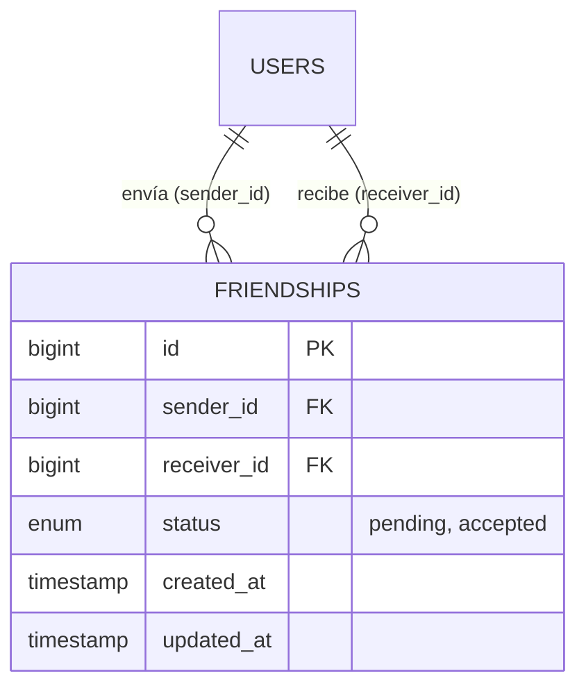
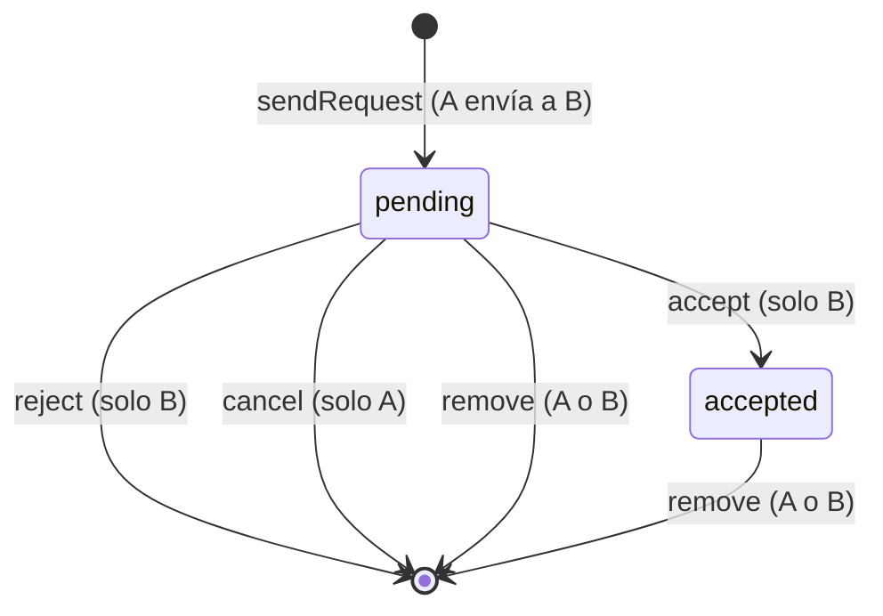
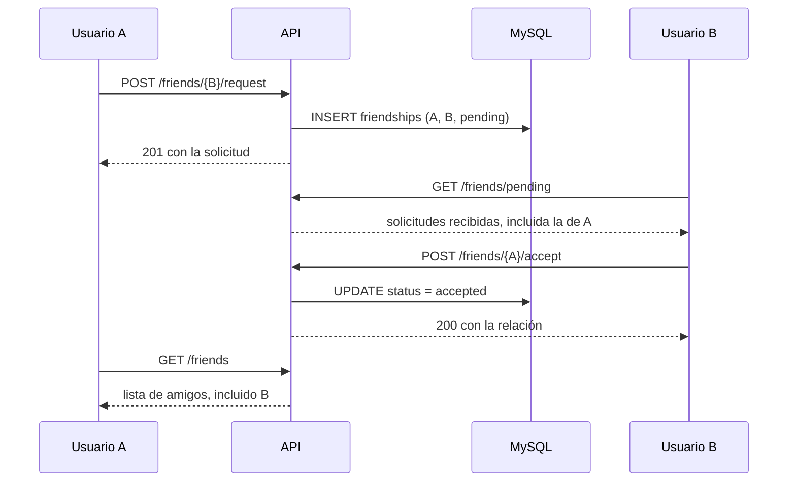

# Sistema de amistades

Este documento describe cómo funciona el sistema de amistades de Chaos Inc.: el modelo de datos, el ciclo de vida de una solicitud, los endpoints, las reglas de negocio y cómo lo consume el frontend.

**Código fuente de referencia**

| Pieza | Archivo |
| --- | --- |
| Controlador | [`FriendshipController`](../backend/app/Http/Controllers/Auth/FriendshipController.php) |
| Lógica de negocio | [`FriendshipService`](../backend/app/Services/Auth/FriendshipService.php) |
| Modelos | [`Friendship`](../backend/app/Models/Friendship.php), [`User`](../backend/app/Models/User.php) (relaciones y *helpers*) |
| Respuesta de solicitudes | [`FriendRequestResource`](../backend/app/Http/Resources/FriendRequestResource.php) |
| Migración | [`2026_05_18_011329_friendships.php`](../backend/database/migrations/2026_05_18_011329_friendships.php) |
| Rutas | [`routes/api.php`](../backend/routes/api.php) (grupo `friends`) |

---

## Índice

1. [Visión general](#1-visión-general)
2. [Modelo de datos](#2-modelo-de-datos)
3. [Ciclo de vida de una relación](#3-ciclo-de-vida-de-una-relación)
4. [Referencia de endpoints](#4-referencia-de-endpoints)
5. [Reglas de negocio](#5-reglas-de-negocio)
6. [Formato de las respuestas](#6-formato-de-las-respuestas)
7. [El lado del cliente](#7-el-lado-del-cliente)
8. [Consideraciones y limitaciones](#8-consideraciones-y-limitaciones)

---

## 1. Visión general

La amistad es una relación **bidireccional y con confirmación**: un usuario envía una solicitud y la otra persona debe aceptarla. Una vez aceptada, ambos se ven mutuamente como amigos.

- Se gestiona íntegramente en **MySQL** (tabla `friendships`); no usa Redis.
- Es una funcionalidad **sin tiempo real**: no emite eventos por WebSocket. El cliente vuelve a pedir las listas tras cada acción.
- Todas las rutas requieren estar autenticado (`auth:sanctum`) y están bajo el limitador `api` (50 peticiones/minuto).
- La interfaz de amistades vive en el **perfil de usuario**.

---

## 2. Modelo de datos

### Tabla `friendships`

| Columna | Tipo | Descripción |
| --- | --- | --- |
| `id` | bigint | Clave primaria. |
| `sender_id` | FK → `users.id` | Quien envía la solicitud. `ON DELETE CASCADE`. |
| `receiver_id` | FK → `users.id` | Quien la recibe. `ON DELETE CASCADE`. |
| `status` | enum | `pending` (por defecto) o `accepted`. |
| `created_at`, `updated_at` | timestamps | |

Restricción única sobre `(sender_id, receiver_id)`: un usuario no puede enviar dos solicitudes a la misma persona.



### Relaciones en el modelo `User`

Como la relación se guarda **en una sola dirección** (quien envió y quien recibió), el modelo `User` la reconstruye con dos relaciones y las une:

| Miembro | Descripción |
| --- | --- |
| `friendsOfMine()` | Amigos cuya solicitud **envié yo** y fue aceptada. |
| `friendOf()` | Amigos que **me enviaron** la solicitud y yo acepté. |
| `getFriends()` | Une ambas colecciones (`merge` + `unique('id')`). Requiere que las dos relaciones estén cargadas. |
| `sentFriendRequests()` / `receivedFriendRequests()` | Filas de `friendships` enviadas / recibidas. |
| `friendshipWith(User $user)` | Busca la fila entre dos usuarios **en cualquier dirección**. Es la base de las comprobaciones del servicio. |

---

## 3. Ciclo de vida de una relación

La relación entre dos usuarios solo puede estar en tres situaciones: **no existe**, **pendiente** o **aceptada**. No existen los estados «rechazada» ni «bloqueada»: rechazar, cancelar o eliminar **borran la fila**.





---

## 4. Referencia de endpoints

Prefijo `/api/v1/friends`. En las rutas con `{user}` se envía el **ID del otro usuario** (el *route model binding* de Laravel lo resuelve; si no existe, o es un usuario archivado, responde `404`).

| Método y ruta | Quién puede | Descripción | Respuesta correcta |
| --- | --- | --- | --- |
| `GET /friends` | Autenticado | Lista de **amigos confirmados**. | `200` con `data` (lista de amigos). |
| `GET /friends/pending` | Autenticado | Solicitudes **recibidas** pendientes. | `200` con `data` (lista de solicitudes). |
| `GET /friends/sent` | Autenticado | Solicitudes **enviadas** pendientes. | `200` con `data` (lista de solicitudes). |
| `POST /friends/{user}/request` | Autenticado | Envía una solicitud a `{user}`. | `201` con `data` (la relación creada). |
| `POST /friends/{user}/accept` | **Receptor** | Acepta la solicitud que `{user}` le envió. | `200` con `data` (la relación). |
| `POST /friends/{user}/reject` | **Receptor** | Rechaza la solicitud que `{user}` le envió. | `200` con `data: null`. |
| `POST /friends/{user}/cancel` | **Remitente** | Cancela la solicitud pendiente que envió a `{user}`. | `200` con `message`. |
| `DELETE /friends/{user}` | Cualquiera de los dos | Elimina la amistad o la solicitud pendiente con `{user}`. | `200` con `message`. |

Los endpoints no reciben cuerpo; toda la información viaja en la URL y en la sesión.

### Errores

Todos los errores de negocio responden con `{ "message": "…" }`:

| Situación | Endpoint | HTTP | Mensaje |
| --- | --- | :---: | --- |
| Enviarse una solicitud a uno mismo | `request` | 422 | No puedes enviarte una solicitud a ti mismo. |
| Ya sois amigos | `request` | 409 | Ya sois amigos. |
| Ya existe una solicitud pendiente (en cualquier dirección) | `request` | 409 | Ya existe una solicitud pendiente. |
| No hay solicitud pendiente de ese usuario | `accept`, `reject` | 404 | Solicitud no encontrada. |
| No existe ninguna relación | `DELETE` | 404 | No existe ninguna relación con este usuario. |
| Cancelar una solicitud a uno mismo | `cancel` | 422 | No puedes cancelar una solicitud a ti mismo. |
| No hay solicitud pendiente enviada a ese usuario | `cancel` | 404 | No se encontró ninguna solicitud pendiente enviada a este usuario. |
| Usuario inexistente o archivado | todos con `{user}` | 404 | — |
| Sin sesión | todos | 401 | — |
| Demasiadas peticiones | todos | 429 | — |

---

## 5. Reglas de negocio

[`FriendshipService`](../backend/app/Services/Auth/FriendshipService.php) concentra las reglas; el controlador solo traduce el resultado a HTTP.

**Enviar una solicitud (`sendRequest`)**

1. No se puede enviar a uno mismo.
2. Se busca una relación previa **en ambas direcciones** (`friendshipWith`). Si existe, se rechaza: `accepted` → «Ya sois amigos», `pending` → «Ya existe una solicitud pendiente».
3. Si no hay nada, se crea la fila con estado `pending`.

> **No hay aceptación automática.** Si B ya había enviado una solicitud a A y A intenta enviarle otra a B, recibe `409`: debe aceptar la solicitud entrante.

**Aceptar (`acceptRequest`)** — el usuario autenticado es el **receptor**. Busca la fila `sender = {user}`, `receiver = yo`, `pending`; si no existe, `404`. Cambia el estado a `accepted`.

**Rechazar (`rejectRequest`)** — igual que aceptar, pero **borra** la fila. El remitente podrá volver a enviar una solicitud más adelante, pues no queda registro.

**Cancelar (`cancelRequest`)** — el usuario autenticado es el **remitente**. Solo funciona si la solicitud sigue `pending`; la borra.

**Eliminar (`removeFriend`)** — busca la relación en cualquier dirección y la borra, sea cual sea su estado. Sirve tanto para **eliminar un amigo** como para cancelar una solicitud (o rechazarla, si lo hace el receptor).

**Quién ve qué**

- `GET /friends` devuelve la unión de `friendsOfMine` y `friendOf`.
- `GET /friends/pending` filtra por `receiver = yo` y `pending`; `GET /friends/sent`, por `sender = yo` y `pending`.
- La lista de amigos de **cualquier usuario es pública** para el resto de usuarios autenticados: `GET /users/{user}` carga las dos relaciones y `UserResource` incluye el campo `friends` (id, nombre, avatar y XP).

---

## 6. Formato de las respuestas

### Amigo (`GET /friends`)

```json
{
  "data": [
    { "id": 7, "username": "Ana", "avatar": "avatars/7.png", "totalXp": 1240 }
  ]
}
```

### Solicitud (`GET /friends/pending` y `GET /friends/sent`)

[`FriendRequestResource`](../backend/app/Http/Resources/FriendRequestResource.php) calcula quién es «el otro» según el usuario autenticado, de modo que el cliente siempre recibe en `user` a la **otra persona**.

```json
{
  "data": [
    {
      "id": 31,
      "status": "pending",
      "createdAt": "2026-06-01T10:15:00+00:00",
      "direction": "received",
      "user": { "id": 7, "username": "Ana", "avatar": "avatars/7.png", "totalXp": 1240 }
    }
  ]
}
```

`direction` es `received` si el usuario autenticado es el receptor, y `sent` si es el remitente.

### Relación creada o aceptada (`request`, `accept`)

Devuelve el modelo `Friendship` tal cual:

```json
{ "data": { "id": 31, "sender_id": 12, "receiver_id": 7, "status": "pending",
            "created_at": "…", "updated_at": "…" } }
```

---

## 7. El lado del cliente

| Responsabilidad | Código del frontend |
| --- | --- |
| Estado y llamadas a la API | `store/auth/useFriendsStore.ts` |
| Acceso al *store* desde componentes | `hooks/auth/useFriends.ts` |
| Acciones del perfil con avisos (*toasts*) y recargas | `hooks/profile/useFriendActions.ts` |
| Botones «agregar» / «eliminar amigo» y bandeja de solicitudes | `components/profile/information/UserNameAndActions.tsx` |
| Bandeja con pestañas **entrantes** y **salientes** | `components/profile/information/FriendRequestsModal.tsx` |
| Lista de amigos del perfil | `components/profile/information/FriendList.tsx` |
| Tipos (`FriendSummary`, `FriendRequest`) | `types/user.ts` |

Comportamiento relevante:

- **Antes de cada operación que modifica datos**, el *store* pide `/sanctum/csrf-cookie` (`getCsrfCookie`).
- Tras enviar, aceptar, rechazar o eliminar, **se recargan las listas** afectadas (no hay actualización en vivo): enviar recarga enviadas y recibidas; aceptar recarga amigos, recibidas y enviadas; rechazar recarga recibidas; eliminar recarga amigos y enviadas.
- En el **perfil propio** se cargan las solicitudes recibidas al montar, para mostrar el *badge* con el número de solicitudes pendientes. Las enviadas se cargan al abrir la bandeja.
- En el **perfil de otro usuario** se carga la lista de amigos propia para decidir si mostrar «Enviar solicitud» o «Eliminar de amigos».
- La acción **«Cancelar»** de la pestaña de salientes usa `DELETE /friends/{user}` (`removeFriend`); el endpoint específico `POST /friends/{user}/cancel` existe en la API pero no lo utiliza el cliente actual.
- Los **invitados no participan** en la práctica: su perfil es una vista reducida (`GuestProfileView`) y el perfil público de un invitado no es accesible, por lo que la interfaz no ofrece amistades con ellos.

---

## 8. Consideraciones y limitaciones

- **Sin restricción de invitados en el servidor.** La limitación anterior es solo de interfaz: el backend no comprueba `is_guest` al enviar o aceptar solicitudes.
- **Sin notificaciones ni tiempo real.** Una solicitud nueva no se refleja hasta que el receptor recarga su bandeja o su perfil.
- **Sin bloqueo de usuarios ni límites** de número de amigos ni de solicitudes; las listas no están paginadas.
- **Duplicados cruzados.** La restricción única solo cubre una dirección (`sender → receiver`). La comprobación de la dirección contraria se hace en el servicio, sin transacción ni bloqueo; en teoría, dos solicitudes simultáneas cruzadas (A→B y B→A) podrían crear dos filas.
- **Usuarios eliminados.** Al borrar una cuenta (se anonimiza y se archiva con *soft delete*, y lo mismo ocurre con los invitados que caducan) **sus filas de `friendships` no se eliminan**, pero el usuario deja de aparecer en las listas de amigos. El `ON DELETE CASCADE` solo actuaría ante un borrado físico.
- **Método sin uso.** `FriendshipService::getFriends()` llama a `$user->friends()`, un método que no existe en el modelo. No se invoca en ningún sitio (el controlador usa `getFriends()` del modelo `User`), pero fallaría si se usara.
