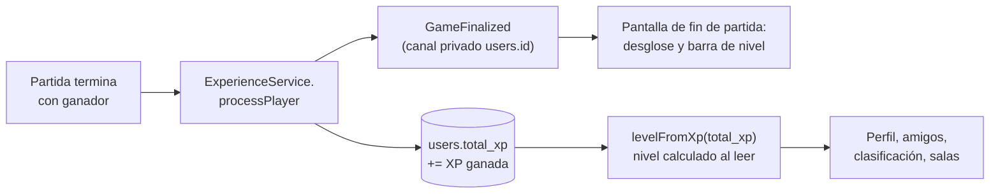
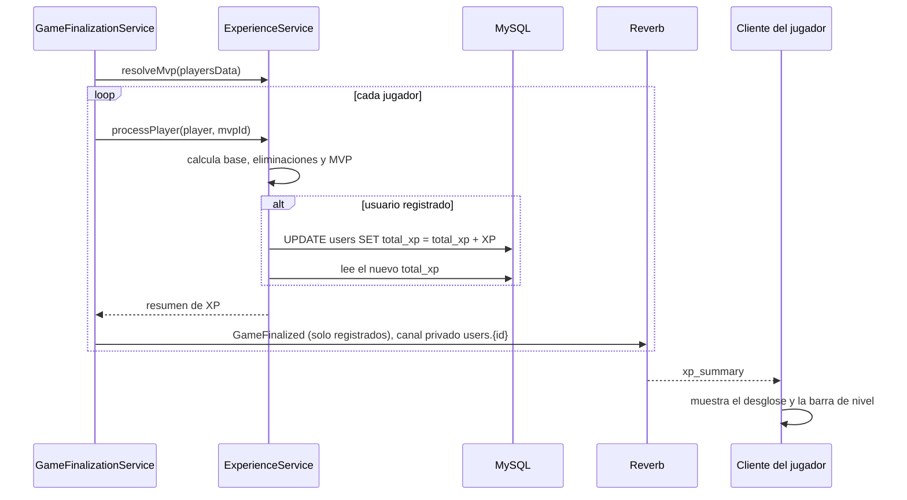

# Sistema de niveles y experiencia

Este documento explica cómo ganan experiencia (XP) los jugadores de Chaos Inc., cómo se convierte esa experiencia en un nivel, dónde se muestra y cómo modificar las reglas.

**Código fuente de referencia**

| Pieza | Archivo |
| --- | --- |
| Reglas de XP y fórmula de niveles (backend) | [`ExperienceService`](../backend/app/Services/Game/Engine/ExperienceService.php) |
| Concesión de XP al terminar una partida | [`GameFinalizationService::finalize`](../backend/app/Services/Game/Status/GameFinalizationService.php) |
| Evento de resumen de XP | [`GameFinalized`](../backend/app/Events/GameFinalized.php) |
| Fórmula de niveles (frontend, copia) | [`frontend/src/utils/experience.ts`](../frontend/src/utils/experience.ts) |
| Tipos del resumen | [`frontend/src/types/xp.ts`](../frontend/src/types/xp.ts) |
| Dónde se almacena | Columna `users.total_xp` ([migración](../backend/database/migrations/0001_01_01_000000_create_users_table.php)) |

---

## Índice

1. [Visión general](#1-visión-general)
2. [Cómo se gana experiencia](#2-cómo-se-gana-experiencia)
3. [La curva de niveles](#3-la-curva-de-niveles)
4. [Qué ocurre al terminar una partida](#4-qué-ocurre-al-terminar-una-partida)
5. [Dónde se muestra el nivel](#5-dónde-se-muestra-el-nivel)
6. [La API de `ExperienceService`](#6-la-api-de-experienceservice)
7. [Guía: modificar el sistema](#7-guía-modificar-el-sistema)
8. [Puntos a revisar](#8-puntos-a-revisar)

---

## 1. Visión general

- Cada usuario registrado tiene un **total de experiencia acumulada** (`users.total_xp`). Es lo único que se guarda.
- **El nivel no se almacena: se calcula** a partir de `total_xp` cada vez que hace falta, con una fórmula determinista. Por eso, cambiar la fórmula cambia al instante el nivel de todos los usuarios, sin migraciones.
- El **nivel máximo es el 50**. Pasado ese punto la XP sigue acumulándose, pero el nivel no sube.
- Solo los **usuarios registrados** ganan XP. Los invitados no reciben nada: en su pantalla de fin de partida se les invita a crear una cuenta para ganar XP.
- La XP se concede **exclusivamente al terminar una partida con resultado** (no en partidas canceladas).



---

## 2. Cómo se gana experiencia

La XP de una partida se compone de **tres conceptos** (constantes de `ExperienceService`):

| Concepto | Constante | XP | Condición |
| --- | --- | :-: | --- |
| **Victoria** | `XP_WIN` | **100** | El jugador está en el bando ganador. |
| **Derrota** | `XP_LOSS` | **30** | El jugador está en el bando perdedor (aunque haya sido eliminado). |
| **Eliminación** | `XP_ELIMINATION` | **+20** por cada una | Por cada jugador que eliminó. |
| **MVP** | `XP_MVP` | **+15** | Ser el jugador que **más daño causó** en la partida. |

```text
XP total = (100 si gana, 30 si pierde) + 20 × eliminaciones + (15 si es MVP)
```

**Ejemplos**

| Situación | Cálculo | XP |
| --- | --- | :-: |
| Gana sin eliminar a nadie ni ser MVP | 100 | 100 |
| Pierde sin hacer nada destacable | 30 | 30 |
| Gana con 2 eliminaciones | 100 + 40 | 140 |
| Gana, 1 eliminación y MVP | 100 + 20 + 15 | 135 |
| Pierde pero es MVP con 1 eliminación | 30 + 20 + 15 | 65 |

**Quién es el MVP.** `resolveMvp` recorre a los jugadores y elige al de mayor `damage_dealt`; en caso de **empate se queda con el primero** encontrado. Si **nadie causó daño** (todos con 0), **no hay MVP**.

**Quién *no* recibe XP**

- Los **invitados** (el resumen se calcula internamente pero no se guarda ni se les envía).
- Los jugadores que **abandonaron vivos** antes del final: se les omite del recuento de la partida.
- Todos, si la partida se **cancela** o si no queda nadie conectado al terminar.

---

## 3. La curva de niveles

El coste de cada «escalón» crece con el nivel siguiendo una potencia:

```text
Coste de pasar del nivel N al N+1  =  round( 50 × N^1.5 )
```

con `LEVEL_BASE = 50`, `LEVEL_EXPONENT = 1.5` y `MAX_LEVEL = 50`.

El nivel de un usuario es el mayor `N` tal que la suma de los costes de los niveles anteriores no supera su XP total:

```text
nivel = 1
mientras nivel < 50 y (acumulado + coste(nivel)) <= total_xp:
    acumulado += coste(nivel)
    nivel += 1
```

### Tabla de referencia

| Nivel | XP del escalón anterior | XP total para alcanzarlo | Partidas aprox. ganando (100 XP) | Partidas aprox. ganando (135 XP) |
| :-: | :-: | :-: | :-: | :-: |
| 2 | 50 | 50 | 1 | 1 |
| 3 | 141 | 191 | 2 | 2 |
| 4 | 260 | 451 | 5 | 4 |
| 5 | 400 | 851 | 9 | 7 |
| 10 | 1.350 | 5.552 | 56 | 42 |
| 15 | 2.619 | 15.998 | 160 | 119 |
| 20 | 4.141 | 33.567 | 336 | 249 |
| 25 | 5.879 | 59.404 | 595 | 441 |
| 30 | 7.808 | 94.514 | 946 | 701 |
| 40 | 12.178 | 196.099 | 1.961 | 1.453 |
| **50** | 17.150 | **344.756** | 3.448 | 2.554 |

Los primeros niveles llegan rápido (el nivel 5 en unas 7–9 victorias) y los últimos exigen una dedicación enorme. El nivel 50 es, en la práctica, un objetivo a muy largo plazo.

### Progreso dentro del nivel

Para las barras de progreso, la API de niveles (`totalXpForLevel`) permite saber cuánta XP acumulada corresponde al inicio de cada nivel:

```text
XP en el nivel actual = total_xp − totalXpForLevel(nivel)
XP que cuesta el nivel = totalXpForLevel(nivel + 1) − totalXpForLevel(nivel)
porcentaje = XP en el nivel actual / XP que cuesta el nivel
```

En el nivel máximo (50), el frontend muestra la barra completa y el texto de nivel máximo.

### Rangos

El frontend asigna una etiqueta de **rango** según el nivel (en `getRankLabel`):

| Nivel | Rango |
| --- | --- |
| 1 – 10 | Principiante |
| 11 – 25 | Veterano |
| 26 – 50 | Prejubilado |

---

## 4. Qué ocurre al terminar una partida

Dentro de `GameFinalizationService::finalize`, para cada jugador que no abandonó:



Detalles importantes:

- La suma se hace con **`increment`** directamente en SQL, no leyendo y reescribiendo, para evitar condiciones de carrera si el mismo usuario terminara dos partidas a la vez.
- El nivel **tras** ganar la XP se calcula sobre el nuevo `total_xp`.
- El evento `GameFinalized` se emite **solo a usuarios registrados**, por su canal privado `users.{id}` (solo él puede escucharlo). Los invitados no tienen canal privado.

### Forma del resumen (`xp_summary`)

```json
{
  "breakdown": {
    "base": 100,
    "eliminations": { "count": 1, "xp": 20 },
    "mvp": 15
  },
  "total_earned": 135,
  "account": {
    "total_xp": 5600,
    "level": 10,
    "xp_current": 48,
    "xp_needed": 1581
  }
}
```

| Campo | Significado |
| --- | --- |
| `breakdown.base` | XP por victoria (100) o derrota (30). |
| `breakdown.eliminations` | Nº de eliminaciones y la XP que aportan. |
| `breakdown.mvp` | 15 si fue MVP; 0 si no. |
| `total_earned` | Suma de todo lo anterior. |
| `account` | Estado de la cuenta **después** de sumar. Es `null` para invitados. |
| `account.xp_current` | XP acumulada dentro del nivel actual. |
| `account.xp_needed` | Coste total del nivel actual (para dibujar la barra). |

---

## 5. Dónde se muestra el nivel

| Lugar | Cómo se obtiene el nivel |
| --- | --- |
| **Perfil** (propio y público): «Nivel N — Rango» y barra de progreso | Frontend: `getLevelProgress(totalXp)` en `LevelProgressBar`. |
| **Lista de amigos** | Frontend: `levelFromXp(friend.totalXp)`. La API de amigos devuelve `totalXp`. |
| **Clasificación (top 10)** | Backend: `LeaderBoardResource` devuelve `total_xp` y `level` (calculado con `ExperienceService::levelFromXp`). Se ordena por `total_xp` descendente e ignora a los invitados. |
| **Sala de espera** (nivel de cada jugador) | Backend: `RoomService::getRoom` calcula el nivel de cada usuario registrado (los invitados, nivel 1). |
| **Fin de partida**: desglose de XP y barra | Backend: viene en `xp_summary.account` por el evento `GameFinalized`. |
| **Panel de administración** | El modal de edición de usuario permite **reiniciar la XP a 0** (`resetXp`). |

Cualquier dato de nivel que llegue del servidor está calculado con la misma fórmula que el frontend, porque **la fórmula está duplicada** (ver siguiente apartado).

---

## 6. La API de `ExperienceService`

[`ExperienceService`](../backend/app/Services/Game/Engine/ExperienceService.php) agrupa la lógica. Los métodos de niveles son **estáticos** para poder usarlos desde cualquier parte (recursos, otros servicios).

| Método | Descripción |
| --- | --- |
| `static xpRequiredForLevel(int $level): int` | Coste del escalón del nivel `N` al `N+1`: `round(50 × N^1.5)`. |
| `static levelFromXp(int $totalXp): int` | Nivel correspondiente a una XP total (máximo 50). |
| `static totalXpForLevel(int $level): int` | XP total acumulada necesaria para **estar** en ese nivel. |
| `resolveMvp(array $playersData): ?string` | ID del jugador con más daño causado, o `null`. |
| `processPlayer(array $player, ?string $mvpPlayerId): array` | Calcula la XP de un jugador, la guarda si no es invitado y devuelve el resumen. |

Uso típico:

```php
use App\Services\Game\Engine\ExperienceService;

$level = ExperienceService::levelFromXp($user->total_xp);
```

El frontend tiene una **copia en TypeScript** de la fórmula en [`utils/experience.ts`](../frontend/src/utils/experience.ts) (con el comentario «Mismas constantes que `ExperienceService.php`»), que se usa para el perfil y la lista de amigos sin pedir el nivel al servidor.

---

## 7. Guía: modificar el sistema

### 7.1 Cambiar cuánta XP se concede

Edita las constantes de [`ExperienceService`](../backend/app/Services/Game/Engine/ExperienceService.php) (`XP_WIN`, `XP_LOSS`, `XP_ELIMINATION`, `XP_MVP`). Solo afecta a las partidas **futuras**; el XP ya concedido no se recalcula. No hace falta tocar el frontend: el desglose viene del servidor.

### 7.2 Cambiar la curva o el nivel máximo

Hay que cambiar **las dos copias a la vez**; si no, habrá discrepancias entre el nivel que calcula el servidor y el que calcula el cliente.

| Qué | Backend | Frontend |
| --- | --- | --- |
| Constantes `LEVEL_BASE`, `LEVEL_EXPONENT`, `MAX_LEVEL` | `ExperienceService.php` | `utils/experience.ts` |
| Fórmula del escalón | `xpRequiredForLevel` | `xpRequiredForLevel` |

Consecuencias:

- **El nivel de todos los usuarios cambia al instante** (se recalcula siempre desde `total_xp`). Una curva más exigente bajará los niveles actuales; una más suave los subirá.
- Si cambias `MAX_LEVEL`, revisa los **rangos** (`getRankLabel`) y los textos de nivel máximo.
- Los bucles de `levelFromXp` y `totalXpForLevel` son lineales en el número de niveles: irrelevante con 50, pero ten en cuenta que se ejecutan por cada fila en la clasificación.

### 7.3 Añadir una nueva fuente de XP

Por ejemplo, «+10 XP por curar 5 puntos o más». Pasos:

1. **Constante** nueva en `ExperienceService` (p. ej. `XP_HEALER = 10`).
2. En **`processPlayer`**, calcula el concepto con los datos del jugador (`$player['healing_done']`, …) y súmalo a `$xpTotal`. Si necesitas un dato que no existe en `$playersData`, añádelo como se explica en [`achievements.md`](achievements.md#82-que-necesita-un-dato-nuevo).
3. **Añádelo al resumen** en `buildSummary` (`breakdown`) para que llegue al cliente.
4. **Frontend:** amplía `XpBreakdown` en `types/xp.ts` y muéstralo como una línea más de la lista en [`XPSummaryCard.tsx`](../frontend/src/components/game/overlays/game-over/XPSummaryCard.tsx).

### 7.4 Cambiar los rangos

Las etiquetas de rango se definen en el frontend, en [`utils/experience.ts`](../frontend/src/utils/experience.ts) (`getRankLabel`) y, por separado, en `XPSummaryCard.tsx` (ver puntos a revisar).

### 7.5 Reiniciar o ajustar la XP de un usuario

Desde el panel de administración (editar usuario → reiniciar XP), que llama a `PUT /users/{user}` con `resetXp`. No hay una interfaz para fijar un valor arbitrario.

### 7.6 Probar

Para comprobar niveles sin jugar cientos de partidas:

```bash
php artisan tinker
>>> use App\Services\Game\Engine\ExperienceService;
>>> ExperienceService::levelFromXp(5552);        // 10
>>> ExperienceService::totalXpForLevel(50);      // 344756
>>> App\Models\User::find(1)->update(['total_xp' => 5552]);
```

Y, para ver el desglose real, juega una partida en una **sala de depuración** y fuerza una victoria (`room_actions.force_win`): se ejecuta la finalización completa con el reparto de XP.

---

## 8. Puntos a revisar

| # | Dónde | Observación |
| :-: | --- | --- |
| 1 | `XPSummaryCard.tsx` vs `utils/experience.ts` | Las **etiquetas de rango** no coinciden: el perfil usa *Principiante / Veterano / Prejubilado* y el resumen de fin de partida *Becario / Empleado del Mes / CEO Legendario*, aunque con los mismos umbrales (10 y 25). |
| 2 | `ExperienceService.php` y `experience.ts` | La fórmula está **duplicada** en backend y frontend; no hay ninguna comprobación automática de que coincidan. |
| 3 | `resolveMvp` | En caso de empate de daño, gana el primero de la lista, que sigue el orden interno del conjunto de jugadores de Redis (no es un criterio de desempate definido). |
| 4 | `finalize` | Los jugadores que **abandonan vivos** no reciben XP aunque su bando gane. Es coherente con no contarles la partida, pero conviene que quede claro de cara al jugador. |
