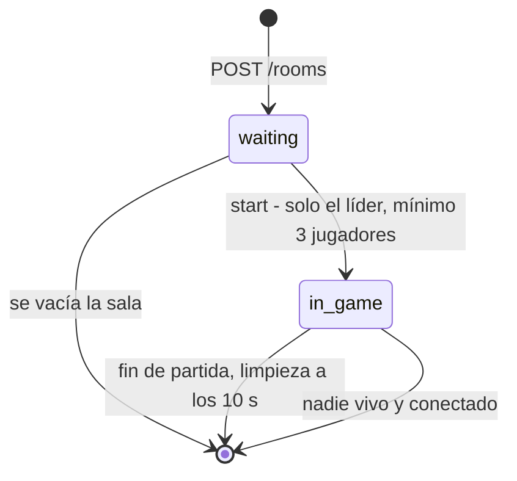
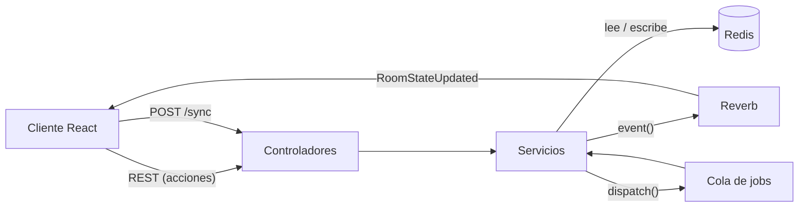
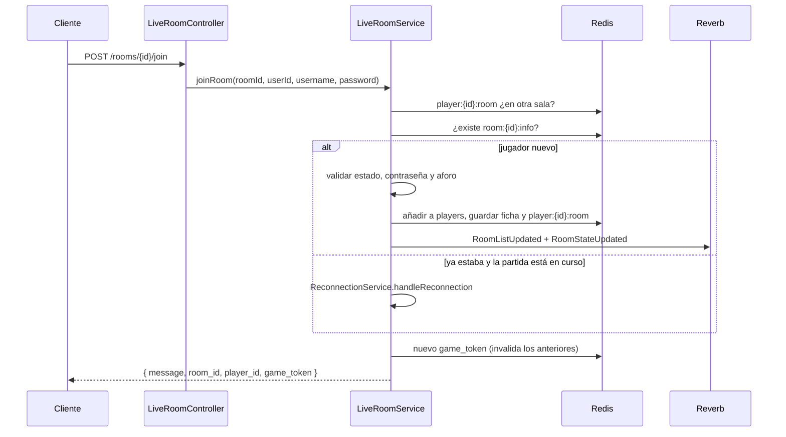
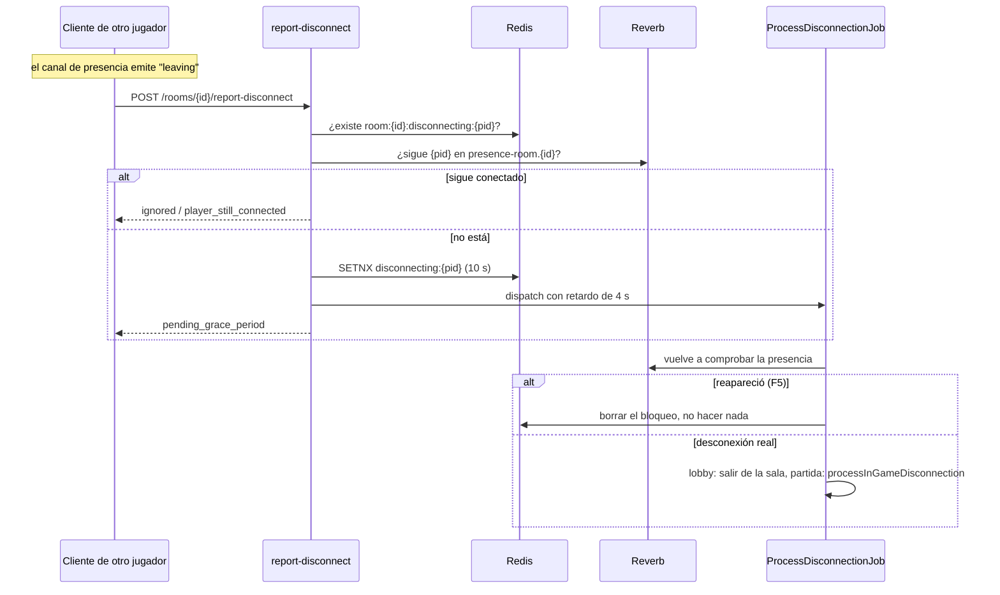
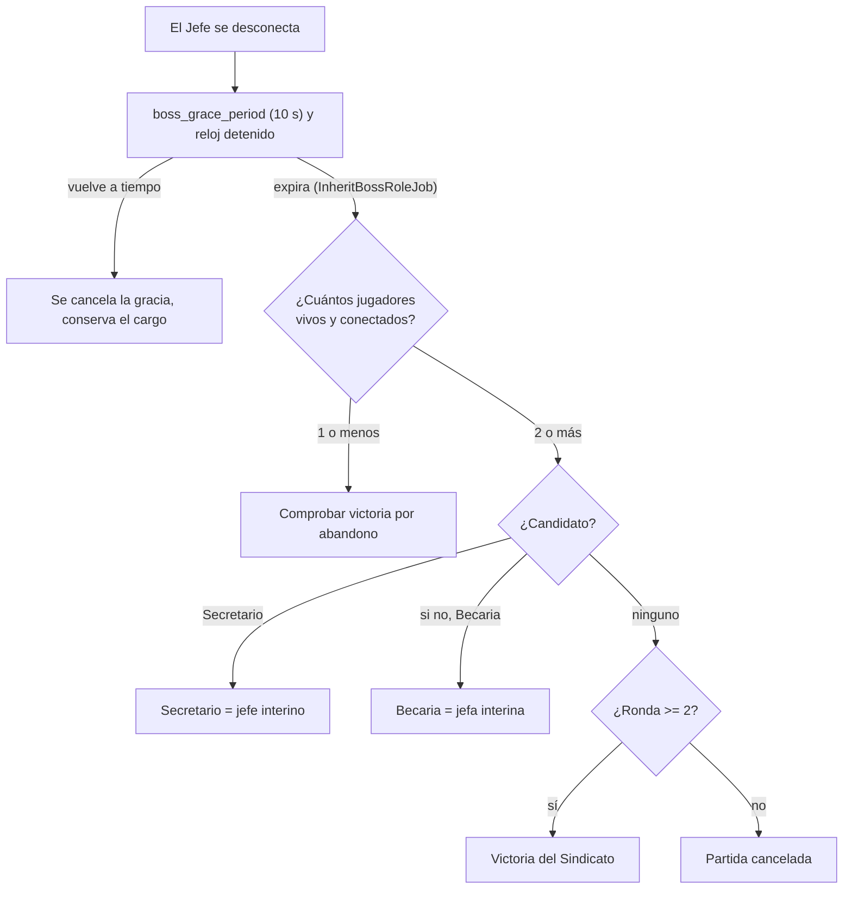
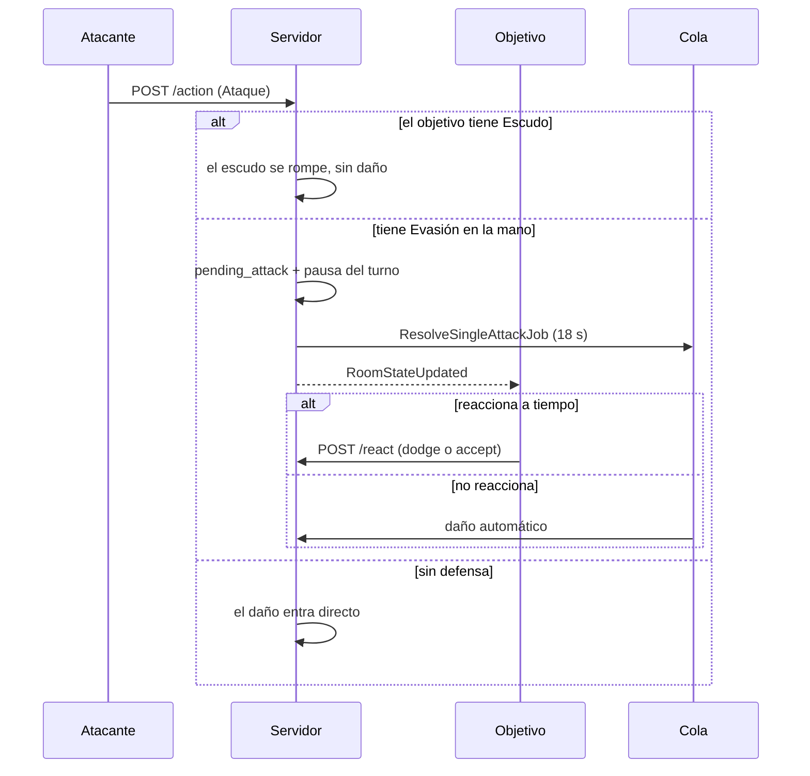

# Sistema de salas y partidas

Este documento explica cómo funcionan las **salas** de Chaos Inc., desde que se crean hasta que la partida termina y se limpian sus datos. Cubre el ciclo de vida de la sala, la identidad del jugador, las desconexiones y reconexiones, y el motor de turnos y reacciones de la partida en curso.

**Código fuente de referencia**

| Pieza | Archivo |
| --- | --- |
| Salas (unirse, salir, expulsar, desconexión) | [`LiveRoomController`](../backend/app/Http/Controllers/Lobby/LiveRoomController.php) → [`LiveRoomService`](../backend/app/Services/Lobby/LiveRoomService.php) |
| Partida (iniciar, sincronizar, jugar) | [`LiveGameController`](../backend/app/Http/Controllers/Lobby/LiveGameController.php) → [`LiveGameService`](../backend/app/Services/Game/LiveGameService.php) y servicios de `Services/Game/` |
| Crear, listar y editar salas | [`Admin/RoomController`](../backend/app/Http/Controllers/Admin/RoomController.php) → [`Admin/RoomService`](../backend/app/Services/Admin/RoomService.php) |
| Rutas | [`routes/api.php`](../backend/routes/api.php), [`routes/channels.php`](../backend/routes/channels.php) |

---

## Índice

1. [Visión general](#1-visión-general)
2. [Conceptos clave](#2-conceptos-clave)
3. [Referencia de endpoints](#3-referencia-de-endpoints)
4. [Ciclo de vida de una sala](#4-ciclo-de-vida-de-una-sala)
5. [Desconexiones y reconexión](#5-desconexiones-y-reconexión)
6. [La partida en curso](#6-la-partida-en-curso)
7. [Fin de la partida](#7-fin-de-la-partida)
8. [Eventos y canales en tiempo real](#8-eventos-y-canales-en-tiempo-real)
9. [Claves de Redis](#9-claves-de-redis)
10. [Códigos de error](#10-códigos-de-error)
11. [El lado del cliente](#11-el-lado-del-cliente)
12. [Puntos a revisar](#12-puntos-a-revisar)

---

## 1. Visión general

Una **sala** es una mesa de entre 3 y 6 jugadores. Pasa por dos estados:



**Principios de diseño**

- **Redis es la fuente de verdad.** Las salas y partidas son efímeras: viven en Redis con caducidad de 24 horas. Solo cuando una partida termina se guarda un resumen en MySQL.
- **El servidor es autoritativo.** El cliente envía la *intención* (jugar una carta, reaccionar) y el servidor valida y decide. Tras cada cambio se emite un evento y los clientes piden su vista del estado.
- **El tiempo se gestiona con *jobs* en cola.** Turnos, ventanas de reacción, desconexiones y limpieza son *jobs* retardados que llevan un **token único**: si el estado cambió mientras esperaban, se ignoran.



---

## 2. Conceptos clave

### Identidad del jugador

El identificador de un jugador dentro de una sala (`playerId`) es el **ID numérico de su usuario** en MySQL. Esto incluye a los **invitados**: un invitado es un usuario real marcado con `is_guest = true`, creado por `POST /guest-login`. Por eso un invitado puede entrar a salas y jugar, pero **no puede crear ni editar salas**.

### Token de partida (`game_token`)

Además de la sesión (cookie), cada jugador recibe al crear la sala o unirse a ella un **`game_token`** (UUID) que lo identifica *dentro de esa sala*.

- Se guarda en Redis: `room:{id}:token:{uuid}` → `playerId`, con caducidad de 24 h.
- El cliente lo envía en la cabecera **`X-Game-Token`** (lo añade automáticamente el interceptor de Axios).
- Todos los endpoints de partida resuelven al jugador **únicamente** a partir de este token (`Redis::get("room:{id}:token:{token}")`). Si no existe o ha caducado responden `401` con `"Token no autorizado o caducado."`.
- Cada vez que se llama a `join`, se **regenera**: se borran los tokens anteriores del jugador en esa sala y se emite uno nuevo ([`TokenService`](../backend/app/Services/Auth/TokenService.php)).
- `/leave` y `/start` aceptan además el token por *query string* o cuerpo, o caen al usuario de la sesión. Esto permite `navigator.sendBeacon` al cerrar la pestaña, que no puede enviar cabeceras.

### Otros conceptos

| Concepto | Descripción |
| --- | --- |
| **`roomId`** | Cadena de 6 caracteres alfanuméricos en mayúsculas (p. ej. `AB12CD`). |
| **Líder (`owner_id`)** | Creador de la sala. Puede editarla, expulsar jugadores e iniciar la partida. Si abandona el lobby, el cargo pasa a un jugador al azar. |
| **Sala de depuración (`is_debug`)** | Solo la pueden crear administradores. Habilita `POST /rooms/{id}/debug`, muestra los roles de todos y activa el registro detallado (`RoomLogger`). |
| **Una sala por jugador** | `player:{playerId}:room` apunta a la sala actual; si existe y es distinta, no se puede entrar a otra (`ALREADY_IN_ANOTHER_ROOM`). |
| **`active_rooms`** | Conjunto de Redis con todas las salas existentes; es lo que lista `GET /rooms`. |

---

## 3. Referencia de endpoints

Prefijo `/api/v1`. Las rutas de esta tabla están bajo el limitador `game-actions` (60 peticiones/minuto por `X-Game-Token` o IP), salvo las dos de lectura pública y la de eliminación (administración), que usan `api` (50/minuto).

### Salas

| Método y ruta | Acceso | Descripción |
| --- | --- | --- |
| `GET /rooms` | Público | Lista las salas activas (sin contraseña). |
| `GET /rooms/{id}` | Público | Detalle de una sala con sus jugadores (nombre, avatar, nivel). |
| `POST /rooms` | Usuario registrado | Crea una sala. Devuelve `201` con los datos y el `game_token` del líder. |
| `PUT /rooms/{id}` | Líder o administrador | Edita una sala en espera. |
| `DELETE /rooms/{id}` | Administrador | Elimina la sala y todas sus claves. |
| `POST /rooms/{id}/join` | Autenticado | Entra a la sala (o se reconecta). Devuelve `game_token`. |
| `POST /rooms/{id}/leave` | Autenticado | Sale de la sala. |
| `POST /rooms/{id}/kick` | Líder | Expulsa a un jugador. |
| `POST /rooms/{id}/report-disconnect` | Autenticado | Un cliente avisa de que otro jugador se ha desconectado. |

### Partida

Requieren `X-Game-Token` (excepto `start`, que también admite la sesión).

| Método y ruta | Cuerpo | Descripción |
| --- | --- | --- |
| `POST /rooms/{id}/start` | — | Inicia la partida (solo el líder). |
| `POST /rooms/{id}/sync` | — | Devuelve la vista del estado de la partida para este jugador. |
| `POST /rooms/{id}/action` | `card_id`, `target_id`, `perk_key?`, `sacrifice_card_id?` | Juega una carta. |
| `POST /rooms/{id}/end-turn` | — | Termina el turno. |
| `POST /rooms/{id}/react` | `reaction` (`dodge` \| `accept`), `card_id?` | Responde a un ataque individual. |
| `POST /rooms/{id}/react-multi` | `reaction`, `card_id?` | Responde a un ataque masivo. |
| `POST /rooms/{id}/react-discard` | `card_id` | Resuelve un sabotaje descartando una carta. |
| `POST /rooms/{id}/discard` | `card_ids[]` | Descarta cartas (límite de mano). |
| `POST /rooms/{id}/discard-perks` | `perk_ids[]` | Descarta pasivas equipadas. |
| `POST /rooms/{id}/luck-challenge` | `color` | Responde a la prueba de suerte (bloqueo). |
| `POST /rooms/{id}/debug` | Ver `DebugRequest` | Solo salas de depuración. |

Las rutas de partida (salvo `debug`) responden con el mismo formato que `/sync`:

```json
{
  "me":   { "id": "12", "role": "union", "stress": 1, "max_stress": 4, "cards": [ … ], "max_hand_size": 4,
            "conditions": { … }, "perks": { … }, "turn_limits": { … }, "combat_state": { … },
            "luck_challenge": null },
  "game": { "current_turn": "7", "opponents": [ … ], "round_number": 2, "deck_count": 61,
            "turn_expires_at": 1767000000, "turn_remaining": 41, "game_over": false, … }
}
```

---

## 4. Ciclo de vida de una sala

### 4.1 Crear una sala

`POST /rooms` ([`RoomService::createRoom`](../backend/app/Services/Admin/RoomService.php))

| Campo | Regla |
| --- | --- |
| `name` | Obligatorio, 3–50 caracteres. |
| `max_players` | Obligatorio, entero de 3 a 6. |
| `is_private` | Obligatorio, booleano. |
| `password` | Obligatoria si la sala es privada, 8–128 caracteres. Se guarda con *hash*. |
| `turn_timeout` | Obligatorio, 60–120 segundos por turno. |
| `is_debug` | Opcional; solo administradores. |

Reglas y efectos:

1. Los **invitados no pueden crear salas** (`403`).
2. Si el usuario ya está en una sala, se rechaza (`400`).
3. Se genera un `roomId` de 6 caracteres y un `game_token`.
4. Se escriben en Redis `info` (con `owner_id`, `owner_name`…), `state` (`status = waiting`), el conjunto de jugadores (con el líder dentro), su ficha de jugador y el token, todo con caducidad de 24 h. La sala se añade a `active_rooms`.
5. Se emiten `RoomListUpdated` y `RoomStateUpdated`.

### 4.2 Listar y consultar

`GET /rooms` recorre `active_rooms` y obtiene toda la información con *pipelines* de Redis (un número fijo de viajes, sin importar cuántas salas haya). Elimina la contraseña de la respuesta. `GET /rooms/{id}` añade avatar y **nivel** de cada jugador, consultando MySQL para los usuarios registrados. Un `roomId` inexistente devuelve `404 ROOM_NOT_FOUND`.

### 4.3 Editar una sala

`PUT /rooms/{id}`. Solo el **líder** o un **administrador**, y solo mientras la sala está en `waiting`.

- `max_players` no puede ser menor que el número de jugadores actuales.
- Si la sala es privada, se puede conservar la contraseña anterior con `keep_password: true`; si pasa a pública, se borra.
- Emite `RoomListUpdated` y `RoomStateUpdated`.

### 4.4 Unirse a una sala

`POST /rooms/{id}/join` — `{ "password": "…" }` (opcional, 8–128 caracteres).



Validaciones, en orden (cada una lanza una `RoomException`/`GameException` que el cliente traduce a una página de error):

| Condición | Error | HTTP |
| --- | --- | :---: |
| Ya está en otra sala (`player:{id}:room`) | `ALREADY_IN_ANOTHER_ROOM` | 400 |
| La sala no existe | `ROOM_NOT_FOUND` | 404 |
| Está registrado en otra sala de `active_rooms` | `ALREADY_IN_ANOTHER_ROOM` | 403 |
| La partida ya empezó (jugador nuevo) | `GAME_ALREADY_STARTED` | 403 |
| Sala privada sin contraseña | `PASSWORD_REQUIRED` | 403 |
| Contraseña incorrecta | `INCORRECT_PASSWORD` | 403 |
| Sala llena | `ROOM_FULL` | 409 |

La respuesta es `"Joined."` para un jugador nuevo o `"Reconnected."` si ya pertenecía a la sala. **Unirse es idempotente**: llamar de nuevo a `join` siendo ya miembro solo renueva el token (o inicia la reconexión si hay partida).

### 4.5 Salir de una sala

`POST /rooms/{id}/leave`. El controlador resuelve al jugador por el `game_token` (cabecera, cuerpo o *query*) y, si no hay, por la sesión. Después, `LiveRoomService::leaveRoom` borra `player:{id}:room` y actúa según el estado de la sala:

| Estado | Qué ocurre |
| --- | --- |
| `waiting` | **Salida inmediata** (`processLobbyLeave`): se elimina al jugador y su token. Si la sala queda vacía, se destruye. Si se iba el líder, el cargo pasa a **un jugador al azar** (`owner_id` y `owner_name`). Se emiten `RoomListUpdated` y `RoomStateUpdated`. |
| `in_game` | **No se elimina al jugador**: se registra una desconexión pendiente y se programa un `ProcessDisconnectionJob` a los 4 s (ver [sección 5](#5-desconexiones-y-reconexión)). El jugador sigue en la partida (para conservar sus estadísticas) pero marcado como desconectado. |

Salir de una sala inexistente da `404`; no pertenecer a ella, `409 NOT_IN_ROOM`. Además, si la sala no está en partida, el controlador borra el `game_token` utilizado.

### 4.6 Expulsar a un jugador

`POST /rooms/{id}/kick` — `{ "player_to_kick_id": 12 }` (entero, debe existir en `users`).

1. El `game_token` enviado debe pertenecer al usuario autenticado; si no, `403`.
2. El servicio comprueba que es el líder (`NOT_LEADER` 403), que no se expulsa a sí mismo (`CANNOT_KICK_SELF` 422) y que el objetivo está en la sala (`NOT_IN_ROOM` 404).
3. Se elimina al jugador del conjunto, se borra su `player:{id}:room` y su token.
4. Se emiten `RoomListUpdated` y `RoomStateUpdated` con `kicked_player_id`. El cliente expulsado reconoce su ID en el evento, muestra un aviso y vuelve a `/rooms`.

### 4.7 Eliminar una sala (administración)

`DELETE /rooms/{id}` (solo administrador): borra `player:{id}:room` de todos los miembros, elimina todas las claves `room:{id}*`, la quita de `active_rooms` y emite `RoomListUpdated`.

---

## 5. Desconexiones y reconexión

El sistema debe distinguir entre una **desconexión real** y un simple refresco de la página (F5) o un corte breve. Para ello combina tres mecanismos: la **presencia** del canal WebSocket, un **aviso de los demás clientes** y un **periodo de gracia** confirmado por un *job*.

### 5.1 Cómo se detecta



- Cuando un cliente ve salir a un jugador del canal `presence-room.{id}`, llama a **`report-disconnect`**. Cualquier cliente conectado puede hacerlo y todos lo harán a la vez; un **bloqueo con `SETNX`** (`room:{id}:disconnecting:{pid}`, 10 s) garantiza que solo se procese una vez.
- El servidor **no se fía del aviso**: consulta a Reverb quién está realmente en el canal de presencia. Si el jugador sigue ahí, ignora el aviso. Por eso un cliente malicioso no puede expulsar a nadie fingiendo una desconexión.
- Se espera **4 segundos** antes de confirmar y se vuelve a comprobar la presencia, de modo que un refresco de página no cuenta como desconexión.
- Salir voluntariamente en partida (`/leave`) pasa por el mismo *job* de 4 s.

> Reverb también puede notificar entradas y salidas por *webhook* (`REVERB_WEBHOOK_URL`), pero actualmente la detección se apoya en los avisos de los clientes y en la consulta de presencia.

### 5.2 Desconexión en la sala de espera

El *job* ejecuta `leaveRoom`: el jugador sale de la sala como se describe en [4.5](#45-salir-de-una-sala) (reasignación de líder, destrucción si queda vacía…).

### 5.3 Desconexión durante la partida

`DisconnectionService::processInGameDisconnection` marca al jugador `is_online = 0` y guarda `disconnected_at`. Después:

1. **Nadie vivo y conectado** → la sala se destruye al instante.
2. **La partida ya terminó** → no se hace nada más.
3. **Era un jugador ya eliminado** → solo se avisa en el registro.
4. **Era el Jefe** → ver [5.4](#54-herencia-del-cargo-de-jefe).
5. Se comprueba si la desconexión provoca una **condición de victoria** (ver [sección 7](#7-fin-de-la-partida)).
6. Si era su turno, se le **recorta la mano** al límite y se **avanza el turno**.
7. Se emite un `RoomStateUpdated` con el mensaje «*X se ha desconectado*».

Los jugadores desconectados se **saltan** al avanzar turnos y dejan de contar como obstáculo para calcular distancias en la mesa.

### 5.4 Herencia del cargo de Jefe

Si el Jefe se cae, la partida no puede quedarse sin él. Se abre una **ventana de gracia de 10 s** durante la que el reloj del turno se detiene:



- **Prioridad de herencia:** Secretario → Becaria. El **jefe interino** (`acting_boss = 1`) cuenta como Jefe para las condiciones de victoria y el límite de estrés (5).
- Si el **jefe interino** también se desconecta, pierde el cargo y se abre otra gracia de 10 s para buscar un nuevo candidato.
- Al reanudar, `TurnService::resumeTurnTimer` restablece el reloj del turno.

### 5.5 Reconexión

Volver a entrar en una sala con partida en curso es simplemente llamar de nuevo a `join` (el cliente lo hace al montar el tablero). [`ReconnectionService`](../backend/app/Services/Game/Status/ReconnectionService.php) actúa así:

| Situación | Resultado |
| --- | --- |
| Volvió **en 3 s o menos** (F5, navegación) | Reconexión silenciosa, **sin penalización**. Si era el Jefe, se cancela su temporizador de herencia. |
| Volvió **más tarde** | Se avisa en el registro y recibe una **penalización**: pierde su siguiente turno (`skip_next_turn`). |
| Vuelve el **Jefe original** | Se cancelan las gracias de herencia y se quita el cargo interino a quien lo tuviera. |
| Vuelve el **Secretario** mientras el Jefe sigue caído | Pasa a ser jefe interino, desplazando a la Becaria si ella lo era. |
| Vuelve alguien durante la **gracia de finalización** | Se cancela el cierre de la partida. |
| Se reanuda el reloj | Si el turno estaba congelado (`turn_expires_at = 0`), se reactiva. |

Tras unirse, el cliente llama a `/sync` y recibe el estado completo.

### 5.6 Resumen de tiempos

| Valor | Para qué |
| :---: | --- |
| **3 s** | Máximo para considerar una reconexión como refresco de página (sin penalización). |
| **4 s** | Espera antes de confirmar una desconexión. |
| **10 s** | Gracia del Jefe / jefe interino; caducidad del bloqueo de desconexión; retardo de la limpieza de sala. |
| **12 s** | Gracia antes de cerrar una partida por abandono. |
| **18 s** | Ventana de reacción a ataques, sabotajes y prueba de suerte. |
| **`turn_timeout` + 3 s** | Cuándo salta el turno automáticamente (3 s de margen por latencia). |
| **24 h** | Caducidad de las claves de sala y de los tokens. |

---

## 6. La partida en curso

### 6.1 Iniciar la partida

`POST /rooms/{id}/start` ([`LiveGameService::startGame`](../backend/app/Services/Game/LiveGameService.php))

Condiciones: la sala existe, quien la inicia es el **líder** (`NOT_LEADER` 403) y hay **al menos 3 jugadores** (`NOT_ENOUGH_PLAYERS` 409).

Preparación:

1. Estado de sala: `status = in_game`, `game_over = 0`, `round_number = 1`.
2. Se **baraja** a los jugadores; ese orden es el **orden de turnos y de asientos** en la mesa circular.
3. Se asignan los **roles** según el número de jugadores ([tabla del README](../README.md#el-juego)).
4. Se construye y baraja el **mazo** a partir de `config/game/cards.php` (94 cartas base, sin las caóticas).
5. Para cada jugador se crean, con caducidad de 24 h: ficha (`info`), estadísticas, estado del turno, pasivas y **3 cartas iniciales**. Para usuarios registrados se cargan sus cartas ya descubiertas desde MySQL, para detectar nuevos descubrimientos.
6. **Empieza el Jefe**: se fija el turno, su expiración y un `AutoEndTurnJob`, y roba 2 cartas.
7. Se emiten `RoomListUpdated`, `RoomStateUpdated` y `GameStarted`. Este último hace que todos los clientes de la sala naveguen a `/game/{id}`.

### 6.2 Sincronización: `/sync`

`POST /rooms/{id}/sync` devuelve la vista del estado **desde el punto de vista del jugador** ([`LiveGameService::getPlayerData`](../backend/app/Services/Game/LiveGameService.php)). Es la única forma de leer el estado de la partida. Errores: sala inexistente (`ROOM_NOT_FOUND`), partida no iniciada (`GAME_NOT_STARTED` 400) o jugador sin ficha (`PLAYER_NOT_FOUND`).

| Bloque | Contenido | Recurso |
| --- | --- | --- |
| `me` | Mi rol, estrés, **mi mano**, límite de mano, condiciones, pasivas, límites del turno, si estoy defendiéndome o atacando, y los colores de la prueba de suerte. | `MyDataResource` |
| `game` | Turno actual y tiempo restante, ronda, tamaño del mazo, oponentes, estado de las gracias de desconexión y ataques pendientes. | `GameDataResource` |

**Información oculta:** de los oponentes solo se ve el **número** de cartas (nunca cuáles), y su rol permanece `hidden` salvo el del Jefe. En salas de depuración se revelan todos los roles.

Cada `/sync` también ejecuta `checkBossGracePeriod`, una comprobación perezosa que garantiza que la herencia del Jefe se resuelva aunque el *job* se retrase.

### 6.3 Turnos

Un turno sigue las tres fases del juego (robar, jugar, descartar). El estado `current_turn_player_id` y un identificador de turno (`current_turn_id`) controlan de quién es el turno; `turn_expires_at` guarda cuándo vence.

**Jugar una carta:** `POST /rooms/{id}/action` ([`GameActionService::playAction`](../backend/app/Services/Game/Actions/GameActionService.php))

1. Comprueba que es tu turno (`NOT_YOUR_TURN` 403) y que **no hay** un ataque o sabotaje pendiente de resolver (`INVALID_ACTION` 422).
2. Comprueba que el objetivo está en la sala y que la carta está en tu mano.
3. **Valida** según el tipo de carta (`CardValidationService`): alcance, límite de un ataque individual por turno, límite de 3 pasivas, objetivo vivo/muerto, carta sacrificada…
4. **Aplica el efecto** (`CardEffectService`).
5. Retira la carta (y la sacrificada) de la mano y actualiza estadísticas.
6. Emite `RoomStateUpdated` con la **carta jugada** (`card_action`), que los clientes usan para animaciones y notificaciones.

| ID | Carta | Efecto |
| :-: | --- | --- |
| 1 | Ataque | 1 de estrés a un oponente dentro de alcance (1 por turno). |
| 2 | Té | −1 estrés propio. |
| 3 | Evasión | Solo se usa como **reacción** a un ataque. |
| 4 | Robo | Roba una carta al azar a un oponente. |
| 5 | Escudo *(pasiva)* | Bloquea el siguiente ataque. |
| 6 | Laxante | Bloquea el siguiente turno de un rival: deberá superar una prueba de suerte (4 colores). |
| 7 | Inspección Sorpresa | Ataque masivo a todos los oponentes vivos. |
| 8 | Viernes de Cañas | −1 estrés a todos los jugadores vivos. |
| 9 | Sabotaje | Obliga a un rival a descartar una carta. |
| 10 | Catalejo *(pasiva)* | +1 de alcance. |
| 11 | Teletrabajo *(pasiva)* | Los demás te ven a +1 de distancia. |
| 12 | Recorte | Elimina una pasiva de un oponente. |
| 13 | Riñonera *(pasiva)* | +1 al límite de mano. |
| 14 | Suerte *(pasiva)* | 50 % de robar una carta extra al empezar el turno. |
| 15 | Monos Locos *(caótica)* | Roba cartas a todos los oponentes. Requiere sacrificar una carta. |
| 16 | Lanzapatatas 3000 *(caótica, pasiva)* | Ataques básicos ilimitados a distancia 1. Requiere sacrificar una carta. |
| 17 | Resurrección *(caótica)* | Revive a un jugador eliminado. Requiere sacrificar una carta. |

**Distancia y alcance** ([`CombatService`](../backend/app/Services/Game/Engine/CombatService.php)): la mesa es circular y solo cuentan los jugadores **vivos y conectados**. La distancia es la más corta entre dos asientos más el bono de *Teletrabajo* del objetivo; el alcance es `1 + Catalejo`.

**Terminar el turno:** `POST /rooms/{id}/end-turn`. Se rechaza si no es tu turno, si la partida está a punto de acabar (`CANNOT_SKIP_DURING_ENDING`), si hay una reacción pendiente o si tu mano excede el límite.

**Límite de mano:** `máx. = max(1, (estrés_máx + 1) − estrés_actual) + Riñonera`, con estrés máximo 5 (Jefe o jefe interino) o 4 (resto). Quien lo supere debe descartar con `/discard`. Si un jugador **descarta toda su mano**, su turno termina.

**Avance de turno** ([`TurnService::advanceTurn`](../backend/app/Services/Game/Engine/TurnService.php)):

- Un bloqueo de 3 s (`advancing_turn`) evita que dos procesos avancen a la vez.
- Recorre el orden de turnos hasta el siguiente jugador **vivo y conectado**; quien tenga `skip_next_turn` (penalización por reconexión) lo pierde.
- Cada vez que se vuelve al primer asiento, `round_number` aumenta.
- El jugador roba 2 cartas (3 con *Suerte*, con un 50 % de probabilidad; si encadena 3 aciertos, se evalúa un logro).
- Si el jugador estaba **bloqueado**, en lugar de turno normal recibe la **prueba de suerte** (ver [6.5](#65-prueba-de-suerte)).
- Se programa el `AutoEndTurnJob` para `turn_timeout + 3 s`.

**Fin de turno por tiempo:** `AutoEndTurnJob` comprueba que sigue siendo el mismo turno (mismo jugador **y** mismo `current_turn_id`). Si es así, descarta el ataque y el sabotaje pendientes, recorta la mano al límite, avanza el turno y emite el aviso «*se ha agotado el tiempo de X*».

### 6.4 Reacciones

Algunas cartas abren una **ventana de reacción de 18 s** en la que la partida se pausa para el resto: el reloj de turno se detiene (`turn_expires_at = 0`), se guarda el tiempo sobrante (`turn_paused_time_left`) y se cambia el identificador de turno para invalidar el `AutoEndTurnJob` original. Al resolverse, `resumeTurnTimer` devuelve el tiempo que quedaba (mínimo 10 s si quedaban 3 o menos).



| Acción | Condición de disparo | Reacción del objetivo | Si no responde |
| --- | --- | --- | --- |
| **Ataque individual** (carta 1) | Objetivo con Evasión y sin Escudo | `POST /react` con `dodge` + `card_id` de una Evasión, o `accept` | `ResolveSingleAttackJob` aplica el daño. |
| **Ataque masivo** (carta 7, sin límite de alcance) | Afecta a todos los oponentes vivos y conectados; los que tienen Escudo lo rompen, los que tienen Evasión pueden decidir y el resto recibe el daño directo | `POST /react-multi`, igual que arriba; cada objetivo responde por separado | `ResolveMultiAttackJob` daña a los que no respondieron. |
| **Sabotaje** (carta 9) | Siempre | `POST /react-discard` con la carta a descartar | `ResolveSabotageJob` descarta una carta al azar. |
| **Bloqueo** (carta 6) | Al llegar el turno del bloqueado | `POST /luck-challenge` (ver más abajo) | `ResolveLuckChallengeJob` salta su turno. |

Los escudos y las evasiones se consumen. El daño pasa siempre por `CombatService::applyDamageAndCheck`: suma 1 de estrés y, si alcanza el máximo, **elimina** al jugador, registra quién lo eliminó y comprueba la victoria.

### 6.5 Prueba de suerte

Un jugador **bloqueado** (carta 6) no juega su turno automáticamente: debe superar una prueba. El servidor elige en secreto uno de cuatro colores (`red`, `blue`, `green`, `yellow`) y lo guarda en `room:{id}:luck_challenge:{pid}` (60 s). El cliente recibe los colores en orden aleatorio y responde con `POST /luck-challenge` `{ "color": "…" }`. La respuesta incluye `_luck_result` (`success` / `fail`).

- **Acierto:** el jugador juega su turno con normalidad.
- **Fallo o tiempo agotado (18 s):** pierde el turno.

### 6.6 Salas de depuración

`POST /rooms/{id}/debug` está protegido por el *middleware* `IsDebugRoom` y solo funciona si la sala se creó con `is_debug`. Permite modificar jugadores y la partida para probar el juego (ver [`DebugService`](../backend/app/Services/Game/DebugService.php)).

---

## 7. Fin de la partida

### 7.1 Condiciones de victoria

Se evalúan tras cada eliminación (`checkAndFinalizeVictory`) y, por separado, tras cada desconexión. El **jefe interino cuenta como Jefe**. Los jugadores muertos o desconectados no cuentan.

| Ganador | Condición (jugadores vivos y conectados) |
| --- | --- |
| **Sindicato** | No queda Jefe (ni jefe interino) y queda al menos un Sindicalista. |
| **Becaria** | No queda Jefe ni Sindicalistas y queda la Becaria. |
| **Jefe** (y Secretario) | Solo queda el Jefe, sin Secretario, Becaria ni Sindicalistas. |

### 7.2 Victoria por abandono

Cuando las desconexiones dejan a un solo bando en pie, la partida no termina al instante:

1. `checkDisconnectionVictory` detecta la condición y abre una **gracia de finalización de 12 s** (`ending_grace_period`). El reloj se detiene y el cliente muestra un aviso.
2. Si alguien vuelve en ese tiempo, la gracia se cancela y la partida continúa.
3. Si no, `CheckVictoryJob` cierra la partida.

Para que una victoria por abandono **cuente**, la partida debe haber llegado al menos a la **ronda 3**; si no, se **cancela**. Si no hay nadie que pueda heredar el cargo de Jefe, la partida cuenta como victoria del Sindicato a partir de la ronda 2 y se cancela antes.

### 7.3 Finalización (`GameFinalizationService::finalize`)

1. Si **no queda nadie conectado** al canal, no se guarda nada y la sala se limpia ya.
2. Se calcula, para cada jugador **que no abandonó** (los desconectados vivos se ignoran), su resultado y sus estadísticas. Los ganadores son: Jefe → {Jefe, Secretario}; Sindicato → {Sindicalistas}; Becaria → {Becaria}.
3. Se elige el **MVP** (quien más daño causó) y se evalúan los **logros** de fin de partida.
4. Se guarda el resultado en MySQL (`games`, `game_user` y `game_card_usage`) en una transacción, **siempre**, aunque todos fueran invitados.
5. Para usuarios registrados: se suma la **experiencia** (victoria 100, derrota 30, +20 por eliminación, +15 de MVP), se guardan las **cartas descubiertas** y se envía `GameFinalized` por su canal privado con el desglose de XP. Los invitados no acumulan progreso.
6. Se emite un último `RoomStateUpdated` con los logros desbloqueados y se programa `CleanupRoomJob` a los 10 s.

Una partida **cancelada** (`cancelAndCleanup`) se guarda con `winner_role = canceled`, marca `game_over` en Redis y se limpia a los 10 s.

### 7.4 Limpieza

`CleanupRoomJob` (con token, para ignorar *jobs* de limpiezas antiguas) llama a `destroyRoom`: borra `player:{id}:room` de todos los jugadores, **todas las claves** `room:{id}*`, quita la sala de `active_rooms` y emite `RoomListUpdated`.

---

## 8. Eventos y canales en tiempo real

| Canal | Tipo | Autorización | Evento | Cuándo se emite |
| --- | --- | --- | --- | --- |
| `lobby` | Público | Ninguna | `RoomListUpdated` | Se crea, modifica o destruye una sala; entra o sale gente; empieza una partida. |
| `room.{roomId}` | **Presencia** | Cualquier usuario autenticado | `RoomStateUpdated` | Cualquier cambio de estado de la sala o la partida. |
| `room.{roomId}` | Presencia | — | `GameStarted` | Al iniciar la partida. |
| `users.{id}` | Privado | Solo el propio usuario | `GameFinalized` | Al terminar la partida, con el resumen de XP. |

Los eventos de sala (`RoomListUpdated`, `RoomStateUpdated`, `GameFinalized`) usan `ShouldBroadcastNow` (se emiten en el acto, sin pasar por la cola).

El payload de `RoomStateUpdated` **no contiene el estado de la partida**; solo avisa de que algo cambió y aporta datos para la interfaz:

```json
{
  "roomId": "AB12CD",
  "log_message": "Ana ha esquivado el ataque de Luis.",
  "card_action": { "card_id": 1, "source": "12", "target": "7" },
  "achievement_notifications": [ { "playerId": "12", "achievementId": "ach_luck" } ],
  "player_drew_extra_card": null,
  "kicked_player_id": null
}
```

---

## 9. Claves de Redis

Las claves principales caducan a las 24 horas; las auxiliares (bloqueos, pruebas de suerte) tienen su propia caducidad o se borran al resolverse. Todas las claves `room:{id}*` se eliminan al destruir la sala. `{pid}` es el ID del jugador.

| Clave | Tipo | Contenido |
| --- | --- | --- |
| `active_rooms` | set | IDs de las salas existentes. |
| `player:{pid}:room` | string | Sala actual del jugador. |
| `room:{id}:info` | hash | `name`, `owner_id`, `owner_name`, `is_private`, `password` (*hash*), `max_players`, `turn_timeout`, `is_debug`. |
| `room:{id}:state` | hash | `status`, `game_over`, `winner_role`, `round_number`, `current_turn_player_id`, `current_turn_id`, `turn_expires_at`, `turn_paused_time_left`, `cleanup_token`. |
| `room:{id}:players` | set | IDs de los jugadores. |
| `room:{id}:token:{uuid}` | string | `game_token` → `pid`. |
| `room:{id}:turn_order` | string (JSON) | Orden de turnos. |
| `room:{id}:deck` | string (JSON) | Mazo restante (se repone solo si se agota). |
| `room:{id}:player:{pid}:info` | hash | `username`, `user_id`, `role`, `stress`, `acting_boss`, `is_online`, `is_dead`, `killer_name`, `is_guest`, `disconnected_at`. |
| `room:{id}:player:{pid}:stats` | hash | `damage_dealt`, `damage_received`, `healing_done`, `cards_played`, `passives_played`, `eliminations`, `dodged_attacks`, `cards_stolen`, `luck_streak`. |
| `room:{id}:player:{pid}:turn_state` | hash | `skip_next_turn`, `single_attack_used_this_turn`, `multi_attack_used_this_turn`, `must_discard`, `sabotage_id`. |
| `room:{id}:player:{pid}:perks` | hash | `has_shield`, `has_storage`, `has_luck`, `has_distance`, `is_blocked`, `vision_bonus`, `has_potato_launcher`. |
| `room:{id}:player:{pid}:hand` | string (JSON) | Mano del jugador. |
| `room:{id}:player:{pid}:card_usage` | hash | Veces que se jugó cada carta. |
| `room:{id}:player:{pid}:known_cards` / `:new_cards` | set | Cartas ya descubiertas y descubiertas en esta partida. |
| `room:{id}:pending_attack` | hash | `attacker`, `target`, `attack_token`. |
| `room:{id}:pending_multi_attack` | string (JSON) | `attacker`, `targets`, `dodgers`, `shielders`, `attack_token`. |
| `room:{id}:pending_sabotage` | string | ID del jugador sabotado. |
| `room:{id}:luck_challenge:{pid}` | string (JSON) | `correct_color`, `challenge_id` (60 s). |
| `room:{id}:boss_grace_period` / `:acting_boss_grace_period` / `:ending_grace_period` | string | Token de la ventana de gracia correspondiente. |
| `room:{id}:disconnecting:{pid}` | string | Bloqueo anti-duplicados de la desconexión (10 s). |
| `room:{id}:advancing_turn` | string | Bloqueo del avance de turno (3 s). |

---

## 10. Códigos de error

Los errores de dominio responden con `{ "error": "…", "type": "…" }`. Los `type` más relevantes para este sistema:

| `type` | HTTP | Significado |
| --- | :---: | --- |
| `ROOM_NOT_FOUND` | 404 | La sala no existe o ya terminó. |
| `ROOM_FULL` | 409 | Aforo completo. |
| `GAME_ALREADY_STARTED` | 403 | La partida ya ha empezado y no eres miembro. |
| `ALREADY_IN_ANOTHER_ROOM` | 400 / 403 | Ya estás en otra sala. |
| `PASSWORD_REQUIRED` / `INCORRECT_PASSWORD` | 403 | Sala privada. |
| `NOT_IN_ROOM` | 409 / 404 | No perteneces a la sala (o el objetivo no está). |
| `NOT_LEADER` | 403 | Solo el líder puede hacerlo. |
| `CANNOT_KICK_SELF` | 422 | No puedes expulsarte. |
| `NOT_ENOUGH_PLAYERS` | 409 | Menos de 3 jugadores. |
| `GAME_NOT_STARTED` | 400 | `/sync` antes de empezar. |
| `PLAYER_NOT_FOUND` | 404 | Sin ficha de jugador en la sala. |
| `NOT_YOUR_TURN` | 403 | Acción fuera de turno. |
| `INVALID_TARGET` | 404 / 422 | Objetivo inválido o fuera de alcance. |
| `CARD_NOT_IN_HAND` | 422 | La carta no está en tu mano. |
| `INVALID_ACTION` | 422 | Acción no permitida en el estado actual. |
| `CANNOT_SKIP_DURING_ENDING` | 422 | No se puede pasar turno con la partida a punto de acabar. |

Otros: `401` con `"Token no autorizado o caducado."` (sin `game_token` válido), `429` (límite de peticiones) y `403` si un invitado intenta crear una sala.

---

## 11. El lado del cliente

| Responsabilidad | Código del frontend |
| --- | --- |
| Estado de la sala y acciones (`join`, `leave`, `start`, `kick`) | `store/room/useRoomStore.ts` |
| Entrada automática, errores → páginas, expulsión | `hooks/room/useRoomSession.ts` |
| Eventos de la sala de espera | `hooks/room/useRoomSockets.ts` |
| Lista de salas en vivo | `hooks/lobby/useLobby.ts`, `useLobbySockets.ts` |
| Panel de la sala (contraseña, nombre de invitado, sala de espera) | `components/lobby/GlobalRoomManager.tsx` |
| Reconexión y sincronización de la partida | `hooks/game/core/useLiveGame.ts`, `store/game/useGameStore.ts` |
| Eventos de la partida y aviso de desconexión | `hooks/game/network/useGameSockets.ts` |
| Aviso de salida al cerrar la pestaña | `hooks/game/network/useLeaveOnUnload.ts` → `utils/leaveRoom.ts` |
| Acciones del jugador | `store/game/useGameActions.ts` |
| Temporizadores y pausas | `hooks/game/core/useGameTimers.ts`, `hooks/game/network/useReconnectionTimers.ts` |

Puntos a tener en cuenta:

- El **temporizador del cliente es solo visual**: se calcula a partir de `turn_expires_at` y `turn_remaining`. Quien decide que un turno ha vencido es el servidor.
- Cada acción bloquea la interfaz (`isActionLocked`) hasta recibir la respuesta, para evitar acciones duplicadas.
- Los errores `ROOM_NOT_FOUND`, `ROOM_FULL`, `GAME_ALREADY_STARTED` y `ALREADY_IN_ANOTHER_ROOM` redirigen a la página de error correspondiente.

---

## 12. Puntos a revisar

Durante la documentación se han detectado comportamientos del código que **no coinciden con la intención descrita** en este documento o con las reglas del juego. Se listan para que se puedan verificar y, en su caso, corregir. Cuando se resuelvan, conviene actualizar las secciones afectadas.

| # | Dónde | Observación |
| :-: | --- | --- |
| 1 | `CheckVictoryJob` → `GameFinalizationService::finalizeVictory` | El *job* llama a `finalizeVictory($roomId, true)`, pero la firma es `(string $roomId, string $winnerRole, bool $isDisconnection = false)`. El `true` se interpreta como rol ganador (`"1"`) y `isDisconnection` queda en `false`, por lo que la victoria por abandono (sección 7.2) no calcula el ganador ni aplica la regla de la ronda 3. |
| 2 | `ReconnectionService::handleReconnection` | Compara `acting_boss_grace_period` con el ID del jugador, pero esa clave guarda un **token** (`grace_acting_…`). La rama «el jefe interino vuelve antes de que expire su gracia» nunca se cumple. |
| 3 | `GameActionService::playAction` | Tras jugar una carta se genera un nuevo `current_turn_id` sin reprogramar el `AutoEndTurnJob`. El *job* original queda obsoleto, así que el salto automático por tiempo no actúa en un turno donde ya se jugó una carta (salvo que se reanude tras una reacción). |
| 4 | `DeckService::maybeInjectChaoticCard` | Lee `config('game.game.cards.cards')`, una ruta que no existe (la correcta es `game.cards.cards`). Con la ruta actual la lista de cartas caóticas queda vacía y **nunca se inyectan** en el mazo. |
| 5 | `GameFinalizationService::checkAndFinalizeVictory` | La victoria del Jefe exige que no quede **ni el Secretario**. Con Jefe y Secretario vivos y el resto eliminados no se declara victoria, aunque las reglas dicen que el Secretario gana con el Jefe (la rama de abandono sí lo contempla). |
| 6 | `LiveGameService::startGame`, `LiveRoomService::kickPlayer` | No comprueban que la sala siga en `waiting`. La interfaz solo ofrece estas acciones en la sala de espera, pero la API las admitiría en una partida en curso. |
| 7 | `StoreRoomRequest::messages` | Los mensajes de error de `turn_timeout` indican 30–90 s, pero la regla real es 60–120 s (como en `UpdateRoomRequest`). |
