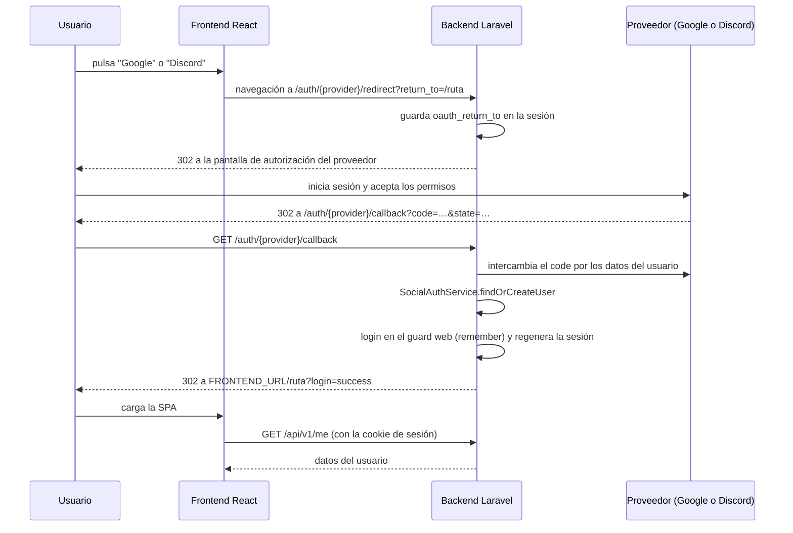
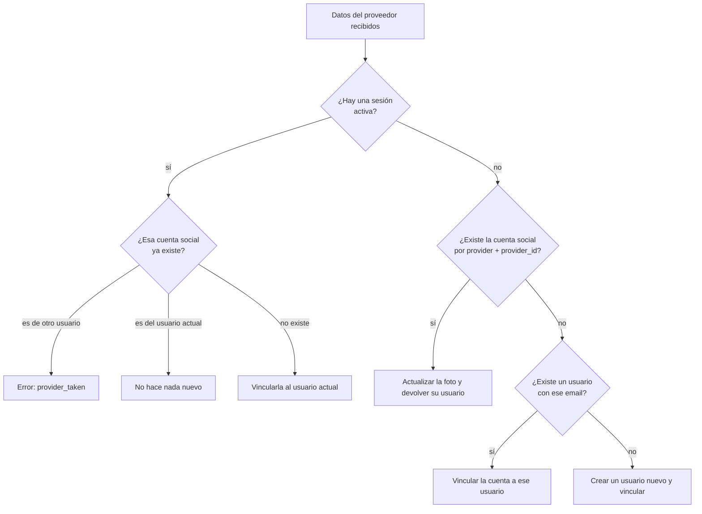
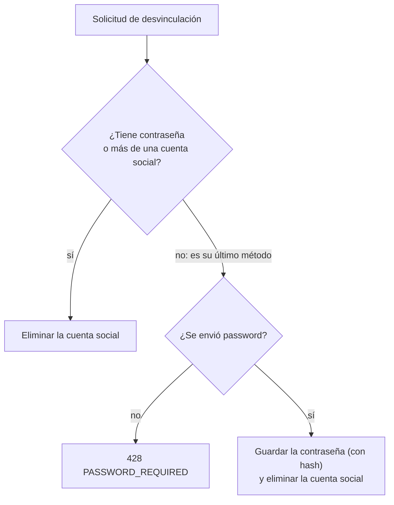

# Autenticación social

Este documento explica cómo funciona el inicio de sesión con **Google** y **Discord** en Chaos Inc.: la configuración necesaria, el flujo OAuth completo, cómo se vinculan y desvinculan las cuentas, y cómo se gestionan los errores.

**Código fuente de referencia**

| Pieza | Archivo |
| --- | --- |
| Controlador (redirección, *callback*, desvinculación) | [`SocialAuthController`](../backend/app/Http/Controllers/Auth/SocialAuthController.php) |
| Lógica de negocio | [`SocialAuthService`](../backend/app/Services/Auth/SocialAuthService.php) |
| Modelo | [`SocialAccount`](../backend/app/Models/SocialAccount.php) y relaciones de [`User`](../backend/app/Models/User.php) |
| Rutas OAuth | [`routes/web.php`](../backend/routes/web.php) |
| Ruta de desvinculación | [`routes/api.php`](../backend/routes/api.php) |
| Configuración | [`config/services.php`](../backend/config/services.php), [`AppServiceProvider`](../backend/app/Providers/AppServiceProvider.php) |
| Migración | [`create_users_table`](../backend/database/migrations/0001_01_01_000000_create_users_table.php) (tabla `social_accounts`) |

---

## Índice

1. [Visión general](#1-visión-general)
2. [Configuración](#2-configuración)
3. [Modelo de datos](#3-modelo-de-datos)
4. [Endpoints](#4-endpoints)
5. [El flujo de inicio de sesión](#5-el-flujo-de-inicio-de-sesión)
6. [Resolución de la cuenta: `findOrCreateUser`](#6-resolución-de-la-cuenta-findorcreateuser)
7. [Vincular una cuenta a un perfil existente](#7-vincular-una-cuenta-a-un-perfil-existente)
8. [Desvincular una cuenta](#8-desvincular-una-cuenta)
9. [Gestión de errores](#9-gestión-de-errores)
10. [El lado del cliente](#10-el-lado-del-cliente)
11. [Consideraciones de seguridad y limitaciones](#11-consideraciones-de-seguridad-y-limitaciones)

---

## 1. Visión general

- Proveedores admitidos: **`google`** y **`discord`** (constante `ALLOWED_PROVIDERS` del controlador; cualquier otro devuelve `404`). Google usa Laravel Socialite y Discord el paquete comunitario `socialiteproviders/discord`.
- Es una **autenticación con sesión (cookies)**, igual que el inicio de sesión con contraseña: al terminar el flujo OAuth, el usuario queda autenticado en el guard `web` y recibe la cookie de sesión. **No se emiten tokens** hacia el frontend.
- Una cuenta de Chaos Inc. puede tener **varios métodos de acceso** a la vez: contraseña, Google y/o Discord. La identidad es siempre el registro de `users`; las cuentas sociales son métodos de acceso adicionales (`social_accounts`).
- Las rutas OAuth viven en `routes/web.php` (no en la API) porque Socialite guarda en la **sesión** el parámetro `state` que protege del CSRF durante el flujo.

---

## 2. Configuración

### 2.1 Variables de entorno (`backend/.env`)

| Variable | Descripción |
| --- | --- |
| `GOOGLE_CLIENT_ID`, `GOOGLE_CLIENT_SECRET` | Credenciales de la aplicación en Google. |
| `GOOGLE_REDIRECT_URI` | URI de retorno. Por defecto `${APP_URL}/auth/google/callback`. |
| `DISCORD_CLIENT_ID`, `DISCORD_CLIENT_SECRET` | Credenciales de la aplicación en Discord. |
| `DISCORD_REDIRECT_URI` | Por defecto `${APP_URL}/auth/discord/callback`. |
| `APP_URL` | URL pública del **backend** (p. ej. `http://localhost:8000` o `https://api.midominio.com`). |
| `FRONTEND_URL` | URL del frontend: destino de todas las redirecciones finales. |
| `SESSION_DOMAIN`, `SANCTUM_STATEFUL_DOMAINS` | Deben incluir el dominio real en producción para que la cookie de sesión funcione. |

Las claves se leen desde `config/services.php`. El proveedor de Discord se registra en `AppServiceProvider` mediante el evento `SocialiteWasCalled`.

### 2.2 Registrar las aplicaciones OAuth

1. **Google** — [Google Cloud Console](https://console.cloud.google.com) → *APIs & Services* → *Credentials* → crear un **ID de cliente de OAuth** de tipo *Aplicación web*. En *URI de redireccionamiento autorizados* añade `{APP_URL}/auth/google/callback`.
2. **Discord** — [Discord Developer Portal](https://discord.com/developers/applications) → crear una aplicación → *OAuth2*. En *Redirects* añade `{APP_URL}/auth/discord/callback`.

> La URI registrada en el proveedor debe coincidir **exactamente** con `*_REDIRECT_URI`, incluyendo el esquema (`http`/`https`) y el puerto.

### 2.3 Permisos solicitados (*scopes*)

- **Google:** los predeterminados de Socialite (identidad, nombre, correo y foto).
- **Discord:** `identify` y `email`, que el controlador solicita de forma explícita.

### 2.4 Requisito de dominio y cookies

El *callback* lo recibe el **backend** y es allí donde se inicia la sesión. Para que el navegador envíe después esa cookie desde el frontend, ambos deben estar en el **mismo sitio** (por ejemplo `localhost:5173` y `localhost:8000` en desarrollo, o `midominio.com` y `api.midominio.com` en producción) y el dominio debe figurar en `SANCTUM_STATEFUL_DOMAINS`. CORS también debe permitir el origen del frontend con credenciales.

---

## 3. Modelo de datos

### Tabla `social_accounts`

| Columna | Descripción |
| --- | --- |
| `id` | Clave primaria. |
| `user_id` | FK → `users.id` (`ON DELETE CASCADE`). |
| `provider_name` | `google` o `discord`. |
| `provider_id` | ID del usuario **en el proveedor** (inmutable; es la clave real de identidad). |
| `provider_avatar` | URL de la foto de perfil en el proveedor (opcional). |
| `created_at`, `updated_at` | Marcas de tiempo. |

Restricciones e índices:

| Restricción | Efecto |
| --- | --- |
| `UNIQUE (user_id, provider_name)` | Un usuario solo puede vincular **una** cuenta de Google y **una** de Discord. |
| `UNIQUE (provider_name, provider_id)` | Una cuenta de Google/Discord solo puede estar vinculada a **un** usuario de Chaos Inc. |
| `INDEX (provider_name)` | Acelera las estadísticas del panel de administración. |

### Cambios en `users` que lo hacen posible

- `password` es **nullable**: una cuenta creada solo con Google/Discord no tiene contraseña.
- `email` es nullable y único. Si el proveedor no entrega correo, se genera uno ficticio (ver [6](#6-resolución-de-la-cuenta-findorcreateuser)).

### Cómo lo expone la API

[`UserResource`](../backend/app/Http/Resources/UserResource.php) incluye:

- `hasPassword` (booleano): indica si el usuario tiene contraseña propia. El cliente lo usa para saber si podrá desvincular su último método de acceso.
- `socialAccounts`: lista de `{ provider, avatar }`. Solo se carga en `GET /users/{user}` cuando quien consulta es **el propio usuario o un administrador**; no es visible para terceros. `GET /me` no la incluye.

---

## 4. Endpoints

| Método y ruta | Acceso | Descripción |
| --- | --- | --- |
| `GET /auth/{provider}/redirect` | Público | Inicia el flujo: redirige a la pantalla de autorización del proveedor. Acepta `?return_to=/ruta`. |
| `GET /auth/{provider}/callback` | Público | Recibe al usuario de vuelta del proveedor, resuelve la cuenta, inicia la sesión y redirige al frontend. |
| `DELETE /api/v1/users/{user}/social/{provider}` | Autenticado (el propio usuario o un administrador) | Desvincula una cuenta social. Cuerpo opcional: `{ "password": "…" }`. |

Las rutas OAuth **no llevan el prefijo `/api/v1`** (están en `web.php`): son `http://localhost:8000/auth/google/redirect`, etc.

---

## 5. El flujo de inicio de sesión



### Paso a paso

**1. Redirección** (`redirect`)

- Si el proveedor no está permitido → `404`.
- Si llega `return_to`, se guarda en la sesión (`oauth_return_to`).
- Para Discord se añaden los *scopes* `identify` y `email`.
- Se devuelve la redirección del proveedor (Socialite genera el `state` y lo guarda en la sesión).

**2. *Callback***

- Se obtiene el usuario del proveedor con `Socialite::driver($provider)->user()`. Si falla (el usuario canceló, `state` inválido, error del proveedor…) se registra el error y se redirige a `/social-error?error=oauth_failed`.
- Se lee si **ya hay una sesión activa** (`Auth::guard('web')->user()`): eso distingue entre *iniciar sesión* y *vincular a un perfil existente*.
- `SocialAuthService::findOrCreateUser` resuelve (o crea) el usuario. Si falla, se traduce la causa a un código de error (ver [9](#9-gestión-de-errores)).
- Si todo va bien: `Auth::guard('web')->login($user, remember: true)` y `session()->regenerate()` (previene la fijación de sesión).
- Se recupera `oauth_return_to` de la sesión (por defecto `/`) y se redirige a `{FRONTEND_URL}{return_to}?login=success`.

---

## 6. Resolución de la cuenta: `findOrCreateUser`

[`SocialAuthService::findOrCreateUser`](../backend/app/Services/Auth/SocialAuthService.php) recibe los datos del proveedor, el nombre del proveedor y el usuario con sesión activa (si lo hay).



### Caso A: ya hay una sesión (vincular)

1. Se busca una `social_accounts` con ese `provider_name` + `provider_id`.
2. Si existe y pertenece a **otro** usuario → se lanza `VND_ALREADY_LINKED_TO_OTHER` (se traduce a `provider_taken`).
3. Si no existe, se **vincula** al usuario actual.
4. Si el usuario no tenía foto de perfil, se usa la del proveedor.
5. Se devuelve el **usuario de la sesión**: no se cambia de identidad.

### Caso B: no hay sesión (iniciar sesión o registrarse)

1. **Cuenta social conocida.** Si ya existe la pareja `provider + provider_id`, se actualiza `provider_avatar` (por si cambió la foto en el proveedor), se completa el `avatar` del usuario si estaba vacío y se devuelve ese usuario.
2. **Usuario con el mismo correo.** Si no hay cuenta social pero el proveedor entrega un correo que ya está en `users`, se **vincula** la nueva cuenta social a ese usuario (así quien se registró con correo y contraseña puede entrar luego con Google).
3. **Usuario nuevo.** Si no coincide nada, se crea (dentro de una **transacción**, para no dejar un usuario huérfano si falla la vinculación):

| Campo | Valor |
| --- | --- |
| `username` | Generado desde el nombre del proveedor (ver abajo). |
| `email` | El del proveedor, o `{provider}_{id}@oauth.noemail` si no lo entrega. |
| `password` | `null` (sin contraseña). |
| `role` | `user`. |
| `is_guest` | `false`. |
| `avatar` | La foto del proveedor. |

Se vincula además su primera cuenta social (`provider_name`, `provider_id`, `provider_avatar`).

### Generación del nombre de usuario

`generateUsername` parte del nombre (o *nickname*) del proveedor:

1. Sustituye espacios por `_` y elimina todo lo que no sea `A-Z`, `a-z`, `0-9` o `_` (si queda vacío, usa `user`).
2. Lo recorta a **12 caracteres**.
3. Si ya existe (sin distinguir mayúsculas), añade un sufijo `_N` con el siguiente número libre (`Ana`, `Ana_2`, `Ana_3`…).

---

## 7. Vincular una cuenta a un perfil existente

Es el mismo *callback* con el **Caso A**. Desde el perfil, el usuario pulsa el botón de un proveedor no vinculado; el cliente navega a `/auth/{provider}/redirect`. Como el navegador ya tiene la cookie de sesión, el *callback* detecta la sesión y vincula en lugar de iniciar sesión.

Rechazos posibles (todos acaban en `/social-error`):

- La cuenta de Google/Discord **ya está vinculada a otro usuario** → `provider_taken`.
- El usuario **ya tiene otra cuenta del mismo proveedor** vinculada (violaría `UNIQUE (user_id, provider_name)`) → `provider_taken`.

---

## 8. Desvincular una cuenta

`DELETE /api/v1/users/{user}/social/{provider}` — cuerpo opcional `{ "password": "…" }` (8 caracteres como mínimo).

**Autorización:** `Gate::authorize('update', $user)` ([`UserPolicy`](../backend/app/Policies/UserPolicy.php)): solo el propio usuario o un administrador.

**Regla de seguridad:** un usuario no puede quedarse **sin ningún método de acceso**. Dentro de una transacción:



| Situación del usuario | Resultado |
| --- | --- |
| Tiene contraseña | Se desvincula sin más (aunque sea su última cuenta social). |
| Sin contraseña y con **2** cuentas sociales | Se desvincula una sin más; le queda la otra. |
| Sin contraseña y con **1** cuenta social, sin `password` en la petición | `428` con `{ "error_code": "PASSWORD_REQUIRED", "message": "…" }`. |
| Sin contraseña y con **1** cuenta social, con `password` | Se establece esa contraseña y luego se desvincula. |

Respuesta correcta (`200`):

```json
{
  "message": "Cuenta desvinculada correctamente.",
  "user": { "id": 12, "username": "Ana", "hasPassword": true, "socialAccounts": [ … ], … }
}
```

Cualquier otro fallo interno responde `500` con `"Error al desvincular la cuenta."`.

**Después de desvincular**, el usuario puede iniciar sesión con correo y contraseña. Antes de tener contraseña, el formulario de login rechaza esa cuenta con el mensaje «*Esta cuenta usa Google para iniciar sesión. Usa el botón correspondiente.*» (`AuthService::login`).

**Herramientas de administración relacionadas**

- `PUT /users/{user}` admite los indicadores `unlinkGoogle` y `unlinkDiscord`, que eliminan la vinculación **sin** pedir contraseña (`UserService::updateUser`). El panel avisa si el usuario no tiene contraseña.
- `POST /users/{user}/temp-password` (administrador) genera una contraseña temporal para recuperar el acceso de un usuario.
- El panel de analíticas cuenta cuántos usuarios usan cada proveedor (`AnalyticsService::getSocialAuthStats`).

---

## 9. Gestión de errores

Los errores del *callback* no se devuelven como JSON, sino que **redirigen al frontend** a `/social-error?error={código}`, porque el usuario llega allí por navegación del navegador.

| Código (`?error=`) | Causa | Cuándo ocurre |
| --- | --- | --- |
| `oauth_failed` | Fallo al hablar con el proveedor, o error genérico al asociar la cuenta. | El usuario cancela, el `state` no coincide, el proveedor rechaza la solicitud o hay un error inesperado. |
| `provider_taken` | La credencial social ya está asignada a otro usuario, o el usuario ya tiene otra cuenta de ese proveedor. | Excepción `VND_ALREADY_LINKED_TO_OTHER` o violación de una de las restricciones únicas de `social_accounts` (error `1062` de MySQL). |
| `email_taken` | El correo ya pertenece a otra cuenta independiente. | Violación de `users_email_unique` al crear el usuario (error `1062`). En el flujo normal el correo existente se vincula, por lo que solo aparece en condiciones de carrera. |

La página [`SocialLinkingErrorPage`](../frontend/src/pages/errors/SocialLinkingErrorPage.tsx) muestra un mensaje y un código para cada caso:

| `?error=` | Código mostrado | Mensaje |
| --- | --- | --- |
| `email_taken` | `AUTH-409` | Este correo electrónico ya está registrado en el perfil de otro usuario. |
| `provider_taken` | `AUTH-403` | Esta credencial de acceso ya está asignada a otro usuario. |
| `oauth_failed` | `AUTH-502` | El proveedor externo ha rechazado la solicitud. Inténtelo de nuevo. |
| otro | `SYS-500` | Se ha producido un error inesperado al conectar cuentas. |

Todos los errores se registran en el log (`Log::error`) con mensaje, archivo y línea.

---

## 10. El lado del cliente

| Responsabilidad | Código del frontend |
| --- | --- |
| Botones «Google» / «Discord» al iniciar sesión | `components/ui/Modals/AuthModal/LoginModal.tsx` |
| Botones al registrarse | `components/ui/Modals/AuthModal/RegisterModal.tsx` |
| Botones al entrar a una sala sin sesión | `components/lobby/GuestNameModal.tsx` |
| Insignias de cuentas vinculadas en el perfil | `components/profile/information/LinkedAccounts.tsx` |
| Vincular, desvincular y modal de contraseña | `store/profile/profileStoreActions.ts` (`handleProviderClick`, `confirmUnlink`) y `components/profile/information/ProfileModals.tsx` |
| Retorno del flujo: leer `?login=success` y cargar la sesión | `hooks/useSessionGuard.ts` |
| Página de error | `pages/errors/SocialLinkingErrorPage.tsx` |

Detalles del comportamiento:

- **Iniciar sesión / registrarse:** el cliente hace una navegación completa (`window.location.href`) a `{VITE_API_URL}/auth/{provider}/redirect?return_to={ruta actual}`, de modo que el usuario vuelve a la página donde estaba (por ejemplo, la sala a la que quería unirse).
- **Vincular desde el perfil:** si el proveedor no está vinculado, navega a `/auth/{provider}/redirect` **sin** `return_to`, por lo que el retorno es a la raíz (`/`).
- **Al volver** con `?login=success`, `useSessionGuard` limpia el parámetro de la URL y llama a `GET /me` para cargar los datos del usuario en el *store* de autenticación.
- **Desvincular:** si el proveedor está vinculado, abre un modal de confirmación y llama al `DELETE`. Si el servidor responde `428` (o `403`), se muestra un segundo modal que pide **crear una contraseña** y se reintenta con el campo `password`. Si tiene éxito, se actualiza el *store* con el usuario devuelto.

---

## 11. Consideraciones de seguridad y limitaciones

**Protecciones existentes**

- El parámetro **`state`** de OAuth, almacenado en la sesión, protege del CSRF durante el flujo.
- La sesión se **regenera** tras el inicio de sesión (contra la fijación de sesión).
- La identidad se determina por **`provider_id`**, no por el correo, y las restricciones únicas de la base de datos impiden que una cuenta social pertenezca a dos usuarios.
- No se puede dejar a un usuario sin método de acceso: desvincular el último exige contraseña.
- La desvinculación está protegida por una política (solo el propietario o un administrador).

**Puntos a tener en cuenta o mejorar**

- **`return_to` no se valida.** El valor se concatena directamente a `FRONTEND_URL` (`{FRONTEND_URL}{return_to}?login=success`). Un valor que no empiece por `/` (por ejemplo `.sitio-malicioso.com` o `@sitio-malicioso.com`) podría redirigir a otro dominio tras el login. Convendría exigir que empiece por `/` y no por `//`.
- **Vinculación automática por correo.** Si un proveedor devuelve un correo que ya existe en `users`, la cuenta social se vincula sin comprobar que el proveedor haya **verificado** ese correo. Google entrega correos verificados; en Discord el correo puede no estarlo.
- **Con sesión activa siempre se vincula.** Si el navegador ya tiene una sesión (incluida una de **invitado**) y se pulsa un botón social, el *callback* vincula la cuenta a **esa** sesión en lugar de iniciar sesión con la cuenta social.
- **El proveedor no se valida al desvincular.** `DELETE …/social/{provider}` acepta cualquier texto; si no coincide con ninguna cuenta, no elimina nada y responde igualmente con éxito.
- **Sin contraseña no hay inicio de sesión por correo.** Las cuentas creadas con Google/Discord no tienen contraseña (`null`); hasta que se establezca una, solo pueden entrar con su proveedor.
- **Añadir más proveedores.** Incorporar otro proveedor exige incluirlo en `ALLOWED_PROVIDERS`, en `config/services.php`, en las variables de entorno y registrarlo en `AppServiceProvider` si es de `socialiteproviders`.
